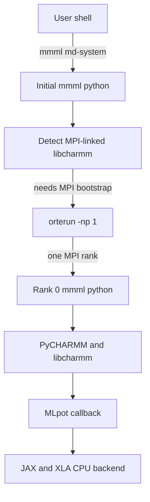
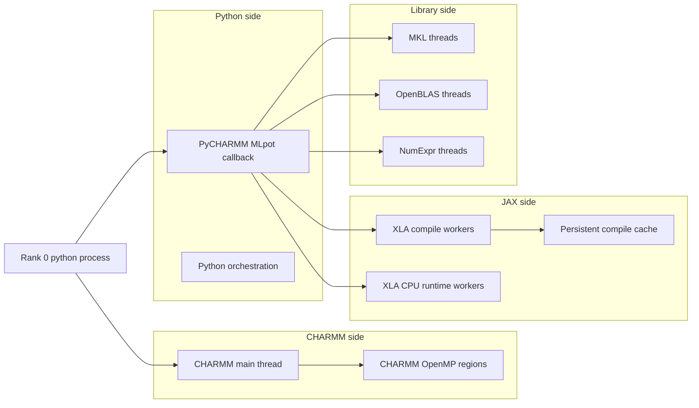
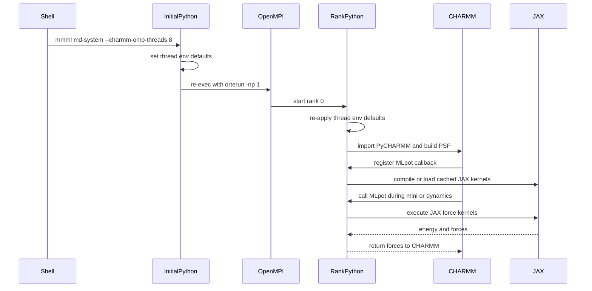
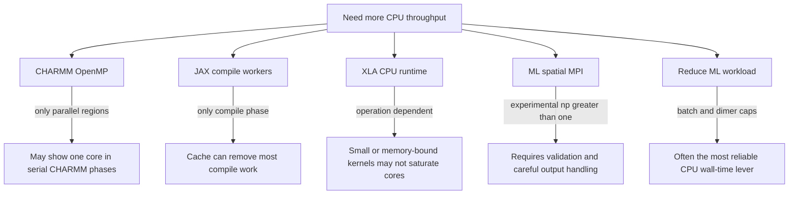

# PyCHARMM, JAX, and CPU Threading

This note explains why a CPU `md-system` run can show `OMP_NUM_THREADS=8` in the
MMML setup panel while `htop` still appears to show one busy thread.

The short version: `MMML_MPI_NP=1` creates one MPI rank. Inside that rank, CHARMM,
JAX/XLA, BLAS, and NumExpr may each use their own thread pools, but only when the
active code path reaches a parallel region large enough to use them. The setting
permits multithreading; it does not force every MD phase to use all cores.

## Launch Chain

When `libcharmm.so` is MPI-linked, `mmml md-system` may re-exec itself under the
matching OpenMPI launcher. That is why the process list shows `orterun -np 1`.



This launch pattern is about MPI runtime compatibility, not automatic parallel
MD decomposition. With `-np 1`, there is still one active simulation rank.

## Thread Pools

Inside the one rank, several independent CPU thread pools may exist.



The runtime dashboard reports the variables that allow these pools to use more
threads:

- `OMP_NUM_THREADS`: OpenMP thread cap seen by CHARMM and OpenMP libraries.
- `MMML_CHARMM_OMP_THREADS`: MMML's CHARMM OpenMP pin.
- `MKL_NUM_THREADS`, `OPENBLAS_NUM_THREADS`, `NUMEXPR_NUM_THREADS`: numeric
  library thread caps.
- `MMML_JAX_COMPILE_THREADS`: MMML's temporary compile-context thread budget.
- `XLA_FLAGS`: XLA CPU thread-pool hints, such as
  `--xla_cpu_multi_thread_eigen=true intra_op_parallelism_threads=8`.
- `JAX_PLATFORMS`: selected JAX backend, usually `cpu` or `gpu`.

## Why `htop` May Still Look Single-Threaded

Common reasons:

- `ps -fa` shows processes, not threads. Use `ps -L` or press `H` in `htop`.
- The current phase may be serial setup, file I/O, PSF/CRD writing, Packmol
  reuse, or CHARMM command processing.
- CHARMM only uses OpenMP inside specific compiled regions. If the active CHARMM
  kernel is serial, `OMP_NUM_THREADS=8` will not create eight busy cores.
- JAX compile threading only applies while tracing/compiling. Once the persistent
  compile cache is hot, little compile work remains.
- XLA CPU runtime parallelism is operation-dependent. Small kernels, sparse
  callback overhead, memory-bound work, or shape/cache reuse can leave one core
  dominant.
- The MLpot callback is entered from CHARMM as a single callback path. Even if
  JAX uses worker threads inside the callback, callbacks are not automatically
  executed concurrently.
- Python orchestration is mostly serial. Python being free-threaded does not make
  this workflow parallel unless the called libraries schedule parallel work.

## Timeline



The `JAX compile-time thread env=8` log line belongs to the compile or factory
context. It is not a promise that every later dynamics step will show eight busy
threads.

## Current MMML Controls

For a CPU experiment:

```bash
mmml md-system --config md_system.yaml --charmm-omp-threads 8
```

Equivalent YAML:

```yaml
charmm_omp_threads: 8
```

When explicit, MMML sets or defaults:

```bash
MMML_CHARMM_OMP_THREADS=8
OMP_NUM_THREADS=8
MKL_NUM_THREADS=8
OPENBLAS_NUM_THREADS=8
NUMEXPR_NUM_THREADS=8
MMML_JAX_COMPILE_THREADS=8
MMML_NO_JAX_COMPILE_THREADS=0
```

If you export a library-specific value first, MMML preserves it:

```bash
export MKL_NUM_THREADS=2
export OPENBLAS_NUM_THREADS=4
mmml md-system --config md_system.yaml --charmm-omp-threads 8
```

## How To Inspect Threads

Use thread-aware process views:

```bash
pid=3345886
ps -L -p "$pid" -o pid,tid,psr,pcpu,comm
```

In `htop`:

- Press `H` to show threads.
- Enable columns for processor, state, and CPU percent.
- Watch during the JAX compile lines and during actual `DYNA` or minimization
  steps separately.

Check the effective env of the rank process:

```bash
tr '\0' '\n' < /proc/$pid/environ | grep -E 'OMP|MKL|OPENBLAS|NUMEXPR|JAX|XLA|MMML_MLPOT'
```

The `/proc` command is Linux-specific and works on the cluster, not macOS.

## What Can Scale



Practical levers:

- Increase `charmm_omp_threads` and benchmark, but measure by stage.
- Keep the JAX compilation cache enabled to avoid repeated compile cost.
- Adjust `ml_batch_size` and `ml_max_active_dimers` to reduce per-step ML work.
- Try `MMML_MPI_NP>1` plus `--ml-spatial-mpi` only as an experimental scaling
  path for ML work, not as a drop-in replacement for OpenMP.
- Profile with `--mlpot-profile` to distinguish CHARMM time, callback time,
  compile time, and JAX execution time.

## Interpretation Checklist

If `Runtime threads` shows 8 but `htop` shows one busy thread:

1. Confirm `htop` is showing threads.
2. Confirm the run is inside mini or dynamics, not setup or I/O.
3. Check whether JAX is compiling or loading from cache.
4. Check `XLA_FLAGS` in the runtime section.
5. Run a short sweep with fixed inputs:

```bash
for t in 1 2 4 8 16; do
  out="artifacts/omp${t}"
  mmml md-system --config md_system.yaml \
    --charmm-omp-threads "$t" \
    --output-dir "$out" \
    --mlpot-profile
done
```

6. Compare wall time and profile output, not just instantaneous CPU bars.

