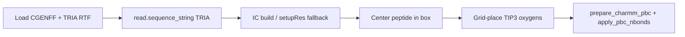

# Tri-alanine water box (CGENFF TRIA)

A minimal **periodic peptide + water** system for PyCHARMM and JAX MM cross-checks — no Packmol, no protein `toppar`, no MLpot.

The peptide is a single CGENFF residue **`TRIA`** (documented as **TRIALANINE**: ACE–ALA×3–CT3) in `mmml/data/charmm/top_trialanine_cgenff.rtf`. Waters are TIP3 on a simple cubic grid inside a cubic cell.


---

## Why a bundled residue?

CHARMM sequence names are at most **four characters**, so the sequence token is `TRIA`, not `TRIALANINE`. The supplemental RTF is appended after the main CGENFF topology so bonded parameters come from `par_all36_cgenff.prm` with CGENFF atom types (`CG311`, `NG2S1`, …).

Regenerate the RTF after topology changes (requires protein toppar **only for export**):

```bash
./scripts/mmml-charmm-mpirun.sh python scripts/export_trialanine_cgenff_rtf.py
```

---

## Build pipeline




Python entry point: `mmml.interfaces.pycharmmInterface.trialanine_water_box.build_trialanine_water_box_in_charmm`.

Default smoke parameters: **10 waters**, **28 Å** cube → **72 atoms** (42 peptide + 30 water).

---

## Smoke build (PyCHARMM)

```bash
./scripts/mmml-charmm-mpirun.sh python -c "
from pathlib import Path
from mmml.interfaces.pycharmmInterface.import_pycharmm import ensure_pycharmm_loaded
ensure_pycharmm_loaded()
from mmml.interfaces.pycharmmInterface.trialanine_water_box import build_trialanine_water_box_in_charmm
box = build_trialanine_water_box_in_charmm(n_waters=10, box_side_A=28.0, seed=11, workdir=Path('/tmp/tria_box'))
print(len(box.positions), box.psf_path)
"
```

Pass criteria: finite coordinates, PSF written, position std ≫ 0 (not collapsed IC).

---

## JAX vs PyCHARMM total-MM cross-check

The functionality test ``test_trialanine_water_total_mm_matches_pycharmm`` compares
``mm_system_energy.py`` (MIC pair loop) to CHARMM ``ENER FORCE``. As of this writing it
**does not pass** at tight tolerance (~10–15 kcal/mol on a 72-atom box). The box build
and **bonded** cross-check are fine; the gap is in **nonbonded** implementation parity.

Run the diagnostic locally::

    ./scripts/mmml-charmm-mpirun.sh python scripts/diagnose_trialanine_nb_mismatch.py

### What we ruled out

- **Toggling ``vfswitch`` alone** does not explain the gap (CHARMM VDW changes by ≲1 kcal
  on a 2× acetone dimer; tri-alanine is similar).
- **Bonded terms match** (bond/angle/dihedral; Urey–Bradley ≈0.2 kcal is omitted in JAX).

### Main contributors (tri-alanine + 10 TIP3, seed 31)

| Term | PyCHARMM | JAX (MIC) | Notes |
|------|----------|-----------|--------|
| VDW | ≈ −2 kcal/mol | ≈ +12–32 kcal/mol | JAX **pep–pep** pairs dominate (+≈10 kcal); CHARMM net VDW ≈ 0 |
| Elec | ≈ −12 kcal/mol | ≈ −15 kcal/mol | Smaller gap when ``MMML_LR_SOLVER=mic`` |

On a simpler **2× ACO** PBC dimer (MIC, ``lr_solver=mic``): VDW Δ ≈ +2 kcal/mol, elec Δ ≈ −14 kcal/mol.

### Root causes (implementation gaps)

1. **Switching models** — Bundled CGENFF declares ``fshift`` (elec) + ``vfswitch`` (VDW) in
   ``par_all36_cgenff.prm``; ``apply_pbc_nbonds`` turns on ``fswitch`` + ``vfswitch`` via the
   PyCHARMM C API. JAX uses a **single Brooks-style potential switch** (``charmm_switch_factor``)
   for **both** VDW and elec. That is not the same as CHARMM ``fshift`` + ``vfswitch``.
2. **Pair list / IMAGE** — JAX builds an O(N²) MIC list from PSF bond exclusions (PyCHARMM
   ``get_iblo_inb()`` returns ``nnb=0`` here, so bond-graph 1–2/1–3 exclusions are used).
   CHARMM uses IMAGE neighbor lists; small residual differences remain even when exclusions look correct.
3. **Single ``RESI TRIA`` (42 atoms)** — All peptide atoms share one residue; CHARMM and JAX
   agree on graph-distance ≥3 pairs, but CHARMM net intra-peptide VDW is much smaller than JAX.
4. **Long-range backend** — ``nonbonded_energy_and_forces`` defaults to ``MMML_LR_SOLVER=auto``,
   which picks **jax-pme** when installed. The test **must** set ``MMML_LR_SOLVER=mic`` (or pass
   ``lr_solver='mic'``); otherwise Coulomb is not comparable to truncated CHARMM ``cdie``.

### Practical guidance

- Treat the tri-alanine box as validated for **CHARMM build + bonded JAX**; use the total-MM
  test as a **regression target**, not a pass/fail gate, until ``mm_system_energy`` implements
  CHARMM ``fshift``/``vfswitch`` and tighter IMAGE parity.
- For production MLpot paths, prefer ``mm_nonbond_mode=periodic_external`` or documented LR solvers
  (see [long-range-solver-tutorial.md](long-range-solver-tutorial.md)), not raw ``mm_system_energy`` MIC.

---

## Tests

```bash
# Bonded + total-MM (total-MM may fail; see above)
./scripts/mmml-charmm-mpirun.sh python -m pytest \
  tests/functionality/charmm/test_trialanine_water_box_mm.py -m pycharmm -v

# Unit tests (no CHARMM)
uv run pytest tests/unit/test_mm_system_energy.py -q
```

See also: [`tests/functionality/charmm/README_trialanine_water_box.md`](../tests/functionality/charmm/README_trialanine_water_box.md).

---

## Doc figures

Illustrative ASE structures (no PyCHARMM) for MkDocs:

```bash
uv run python scripts/generate_docs_figures.py
```

Writes `docs/images/structures/trialanine-water-box.png`, peptide zoom, pipeline plot, and refreshes `mmml/data/charmm/trialanine-water-smoke.extxyz`.
