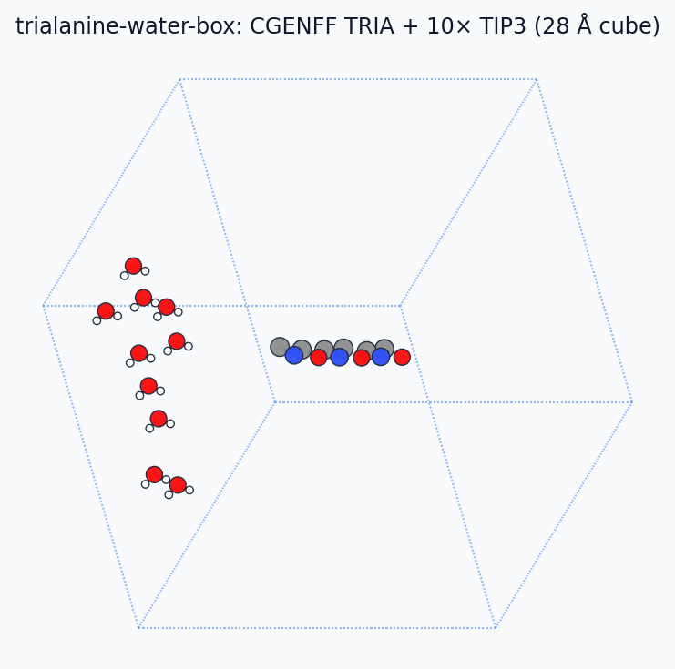
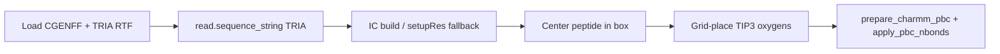
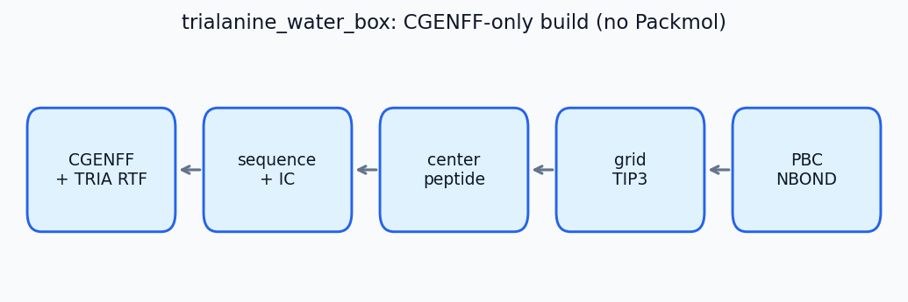

# Tri-alanine water box (CGENFF TRIA)

A minimal **periodic peptide + water** system for PyCHARMM and JAX MM cross-checks — no Packmol, no protein `toppar`, no MLpot.

The peptide is a single CGENFF residue **`TRIA`** (documented as **TRIALANINE**: ACE–ALA×3–CT3) in `mmml/data/charmm/top_trialanine_cgenff.rtf`. Waters are TIP3 on a simple cubic grid inside a cubic cell.



---

## Why a bundled residue?

CHARMM sequence names are at most **four characters**, so the sequence token is `TRIA`, not `TRIALANINE`. The supplemental RTF is appended after the main CGENFF topology so bonded parameters come from `par_all36_cgenff.prm` with CGENFF atom types (`CG311`, `NG2S1`, …).

Regenerate the RTF after topology changes (requires protein toppar **only for export**):

```bash
./scripts/mmml-charmm-mpirun.sh python scripts/export_trialanine_cgenff_rtf.py
```

---

## Build pipeline





Python entry point: `mmml.interfaces.pycharmmInterface.trialanine_water_box.build_trialanine_water_box_in_charmm`.

Default smoke parameters: **10 waters**, **28 Å** cube → **72 atoms** (42 peptide + 30 water).

---

## Smoke build (PyCHARMM)

```bash
./scripts/mmml-charmm-mpirun.sh python -c "
from pathlib import Path
from mmml.interfaces.pycharmmInterface.import_pycharmm import ensure_pycharmm_loaded
ensure_pycharmm_loaded()
from mmml.interfaces.pycharmmInterface.trialanine_water_box import build_trialanine_water_box_in_charmm
box = build_trialanine_water_box_in_charmm(n_waters=10, box_side_A=28.0, seed=11, workdir=Path('/tmp/tria_box'))
print(len(box.positions), box.psf_path)
"
```

Pass criteria: finite coordinates, PSF written, position std ≫ 0 (not collapsed IC).

---

## Tests

Fast unit tests (no CHARMM):

```bash
uv run pytest tests/unit/test_cgenff_cmap.py tests/unit/test_mm_system_energy.py -q
```

Live JAX vs PyCHARMM (CHARMM node):

```bash
./scripts/mmml-charmm-mpirun.sh python -m pytest \
  tests/functionality/charmm/test_trialanine_water_box_mm.py -m pycharmm -v
```

Covers bonded-only, nonbonded-only, and full MM (`lr_solver=mic`) against `ENER FORCE`.

See also: [`tests/functionality/charmm/README_trialanine_water_box.md`](../tests/functionality/charmm/README_trialanine_water_box.md).

---

## Doc figures

Illustrative ASE structures (no PyCHARMM) for MkDocs:

```bash
uv run python scripts/generate_docs_figures.py
```

Writes `docs/images/structures/trialanine-water-box.png`, peptide zoom, pipeline plot, and refreshes `mmml/data/charmm/trialanine-water-smoke.extxyz`.
