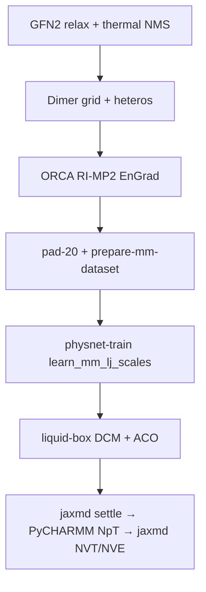

# Trainable CGenFF LJ scales — numbered ladder

Replace a hand-tuned Lennard-Jones grid scan with per-type σ/ε scales that are
**learned by gradient descent** alongside the ML potential, then deploy them in a
condensed-phase MD run.

```bash
source examples/lj_scales/_env.sh
bash examples/lj_scales/run_all.sh          # fast steps only, ~1 min, CPU
LJ_FULL=1 LJ_DEVICE=gpu bash examples/lj_scales/run_all.sh   # everything
```

Reference page: [`docs/hybrid-mm-lj-scales.md`](../../docs/hybrid-mm-lj-scales.md).
Annotated notebook version: [`../hybrid_mm_charges/lj_scales_walkthrough.ipynb`](../hybrid_mm_charges/lj_scales_walkthrough.ipynb).
Cluster job: [`../hybrid_mm_charges/submit_lj_scales_scicore.sbatch`](../hybrid_mm_charges/submit_lj_scales_scicore.sbatch).

## Steps (DCM-only ladder)

| Step | Needs | Time | What it does |
|------|-------|------|--------------|
| [`00_check_env.py`](00_check_env.py) | — | 5 s | Interpreter, JAX device, CGenFF tables, optax, dataset, PyCHARMM |
| [`01_prepare_dataset.sh`](01_prepare_dataset.sh) | dataset | minutes | `prepare-mm-dataset` → adds `cgenff_type_idx` / `cgenff_charge` / `mol_id`, then asserts them |
| [`02_inspect_dataset.py`](02_inspect_dataset.py) | dataset | 5 s | PSF-ordering check + which CGenFF types are actually present |
| [`03_gradient_demo.py`](03_gradient_demo.py) | — | 20 s | Proves ∂E/∂σ and ∂E/∂ε are finite and non-zero; shows the switch killing the gradient with distance |
| [`04_miniature_fit.py`](04_miniature_fit.py) | — | 90 s | Recovers planted scales — **and demonstrates the σ/ε degeneracy** |
| [`05_train.sh`](05_train.sh) | enriched NPZ, GPU | hours | `physnet-train` with `learn_mm_lj_scales` → writes `hybrid_mm.json` |
| [`06_inspect_scales.py`](06_inspect_scales.py) | trained run | 5 s | Reports which types moved, flags implausible values, shows the ATC remap |
| [`07_deploy_md.sh`](07_deploy_md.sh) | trained run, PyCHARMM | minutes–hours | DCM campaign: jaxmd settle → PyCHARMM NVT → jaxmd NVT/NVE (`jax_mic`); `LJ_MD_PROD=1` for 20 ps NVT |
| [`12_analyze_liquid.sh`](12_analyze_liquid.sh) | campaign HDF5 | seconds | density / RDF / MSD / T·E plots via `mmml analyze-liquid` |

Steps **00, 03, 04 are self-contained** — no dataset, no CHARMM, no GPU. Run them
first; they are where the concepts live.

## Joint ACO + DCM path (`LJ_JOINT=1`)

Matched **RI-MP2 / def2-TZVP** labels on an exhaustive dimer grid with **thermal
normal-mode sampling** (not isotropic noise), then pure-ACO and pure-DCM liquid
campaigns:



| Step | Needs | What it does |
|------|-------|--------------|
| [`08_build_joint_geoms.sh`](08_build_joint_geoms.sh) | `LJ_GEOM_SOURCE` (default `examples/mp2_nms15_train.npz`) | NMS conformers × directions × orientations × r; DCM–DCM, ACO–ACO, DCM–ACO; `--geometry-only` |
| [`09_submit_orca_rimp2.sh`](09_submit_orca_rimp2.sh) | cluster ORCA | `LJ_ORCA_MODE=submit` then `collect`; keywords `RI-MP2 def2-TZVP def2-TZVP/C def2/J RIJCOSX TightSCF EnGrad` |
| [`10_merge_prepare_joint.sh`](10_merge_prepare_joint.sh) | labeled splits | pad-merge to 20 atoms + `prepare-mm-dataset` |
| [`05_train.sh`](05_train.sh) | joint enriched NPZ | same trainer; tag `hybrid_mm_fixed_lj_scales_aco_dcm` |
| [`11_liquid_boxes.sh`](11_liquid_boxes.sh) | PyCHARMM | `mmml liquid-box` pure DCM + pure ACO |
| [`07_deploy_md.sh`](07_deploy_md.sh) | ckpt + boxes | campaign [`md_lj_scales_liquid_campaign.yaml`](../hybrid_mm_charges/md_lj_scales_liquid_campaign.yaml) (`LJ_MD_PROD=1` → `.prod.yaml`) |
| [`12_analyze_liquid.sh`](12_analyze_liquid.sh) | campaign HDF5 | `mmml analyze-liquid` → `*/analysis/{metrics.json,rdf.png,…}` |

```bash
export LJ_JOINT=1
export LJ_DEVICE=gpu
source examples/lj_scales/_env.sh

# Smoke geometry grid (still requires NMS >= 2):
LJ_NMS_CONFORMERS=8 LJ_N_DIRECTIONS=2 LJ_N_ORIENTATIONS=2 LJ_N_R=4 \
  bash examples/lj_scales/08_build_joint_geoms.sh

bash examples/lj_scales/09_submit_orca_rimp2.sh          # print sbatch line
# ... wait for array ...
LJ_ORCA_MODE=collect bash examples/lj_scales/09_submit_orca_rimp2.sh

bash examples/lj_scales/10_merge_prepare_joint.sh
bash examples/lj_scales/05_train.sh
uv run python examples/lj_scales/06_inspect_scales.py
bash examples/lj_scales/11_liquid_boxes.sh
bash examples/lj_scales/07_deploy_md.sh
# Longer ⟨ρ⟩ / RDF sampling (hours on GPU):
# LJ_MD_PROD=1 bash examples/lj_scales/07_deploy_md.sh
bash examples/lj_scales/12_analyze_liquid.sh
```

**Do not** concatenate `dcm_mp2_psf_order.npz` with `fixed-acetone-only_MP2_21000.npz`
for joint training — LoT / atom order may differ, and there are no ACO–DCM heteros.

NMS knobs: `LJ_NMS_CONFORMERS` (≥2), `LJ_NMS_TEMPERATURE`, `LJ_NMS_FREQ_MIN`
(default 200 cm⁻¹ drops acetone methyl torsion). Step 08 fails if conformers &lt; 2.

Liquid campaign order (per solvent):

1. **jaxmd_settle** — FIRE + short NVT from certified PSF/CRD  
2. **pycharmm_npt** — CPT heat + equilibration (`jax_mic` + scales)  
3. **jaxmd_nvt** / **jaxmd_nve** — production  
4. **12_analyze_liquid** — RDF first peak + packing/NpT density vs bulk  

Smoke heat uses `dt_fs: 0.25`, Hoover, `heat_ihtfrq: 50`, and ≥2 ps heat
(ASE Bussi @ 0.5 fs previously blew a DCM monomer; all-ML PBC cannot
Packmol-repack). For validation set `LJ_MD_PROD=1` (longer NpT equi + 20 ps
jaxmd NVT). Fixed-box NVT packing density is not a force-field check — use the
joint NpT prod campaign for ⟨ρ⟩.

## Configuration

`_env.sh` sets everything; every variable is `${VAR:-default}` so exports win.

| Variable | Default | Meaning |
|---|---|---|
| `LJ_JOINT` | `0` | `1` → ACO+DCM joint artifacts / steps 08–11 |
| `LJ_DATASET` | DCM NPZ or joint merged | Input QM NPZ |
| `LJ_DEVICE` | `cpu` | `cpu` or `gpu` |
| `LJ_ARTIFACTS_DIR` | `artifacts/lj_scales` or `..._joint` | Outputs |
| `LJ_ENRICHED` | under artifacts | Enriched training NPZ |
| `LJ_CKPT_DIR` / `LJ_TAG` | under artifacts | Training output |
| `LJ_EPOCHS` / `LJ_NTRAIN` / `LJ_NVALID` | 500 / 8000 / 1000 | Training size |
| `LJ_FULL` | `0` | `1` runs expensive steps in `run_all.sh` |
| `LJ_GEOM_SOURCE` | `examples/mp2_nms15_train.npz` | Monomer bank with `res_name` + CGenFF |
| `LJ_BOX_SIZE` / `LJ_BULK_DENSITY_FRACTION` | `28` / `0.5` | Liquid-box smoke sizing |

An explicitly set `LJ_DEVICE` beats an inherited `JAX_PLATFORMS` / `MMML_MLPOT_DEVICE`,
so a stale `export JAX_PLATFORMS=cpu` in a login profile cannot silently downgrade
a GPU run.

Outputs use `LJ_ARTIFACTS_DIR`, not the generic `ARTIFACTS_DIR` that
`examples/m`, `examples/acetone_crystal` and others export from their own
`_env.sh`. Sourcing one of those earlier in the same shell would otherwise send
this ladder's dataset and checkpoints into that study's folder; the banner says
so when it ignores an inherited `ARTIFACTS_DIR`.

`bash 05_train.sh` runs in a subshell, so a `LJ_CKPT_DIR` / `LJ_ARTIFACTS_DIR` it
derived is gone afterwards. Either `source examples/lj_scales/_env.sh` in the
shell you run steps 06 and 07 from, or point step 06 at the run directly:

```bash
LJ_SIDECAR=/path/to/ckpts/<tag>-<uuid>/hybrid_mm.json \
  uv run python examples/lj_scales/06_inspect_scales.py
```

## Three things that will cost you a day

**1. PSF ordering.** `dcm_mp2_psf_order.npz` is `C Cl Cl H H`; the otherwise
identical `new-dcm-round-2-only_MP2_41950.npz` is `C H H Cl Cl`. Only the first
can be typed. The wrong one does **not** crash — it mis-assigns CGenFF types
silently. Step 02 prints both so you can see the difference.

**2. σ/ε are degenerate against energies alone.** A deeper well with a larger
radius gives the same energy as a shallower one with a smaller radius. You can
drive the loss to `1e-15` and still recover the wrong parameters — step 04 part C
does exactly that on purpose. Forces and a range of separations break the tie,
which is why a distance scan beats a pile of equilibrium structures.

**3. `periodic_external` cannot apply trained LJ.** The scales feed the JAX
switched-MM pair loop, which is off in periodic mode; CHARMM IMAGE VDW never reads
`hybrid_mm.json`. Use `jax_mic` (the default). MLpot now raises on
`--mm-lj-scales-file` in that mode rather than ignoring it.

## Jupyter kernel

If you use the notebook rather than these scripts, register the venv kernel once:

```bash
.venv/bin/python -m ipykernel install --user --name mmml-venv --display-name "mmml venv"
```

Otherwise Jupyter's default `python3` kernel may launch a conda interpreter and
every `import mmml...` dies with `TypeError: 'type' object is not subscriptable`.
That is kernel selection, not broken code.

## Honest limitations

- Training LJ requires `lr_solver: mic`. Under `ewald` / `nvalchemiops_pme` the LJ
  term is removed from the hybrid energy, so there is nothing to differentiate.
  This is principled — LJ is short-ranged — but it means the fit sees truncated
  Coulomb, and **Coulomb error can be absorbed into σ/ε**. Mitigate with
  `mm_charge_mode: fixed`, identical cutoffs at train and MD time, and validation
  on a property outside the loss (density, RDF first peak).
- A condensed-phase run with trained LJ therefore uses truncated-MIC
  electrostatics, not Ewald. Combining the two is
  [issue #139](https://github.com/EricBoittier/mmml/issues/139).
- Exhaustive geometry + RI-MP2 is **cluster work**; steps 08–09 prepare/submit/collect
  only. Rigid grids without NMS undertrain intramolecular degrees of freedom.
- Pure-liquid MD does not need TIP3; hetero **ACO–DCM** frames are still required
  in the **training** set so shared CGenFF types see cross contacts.
