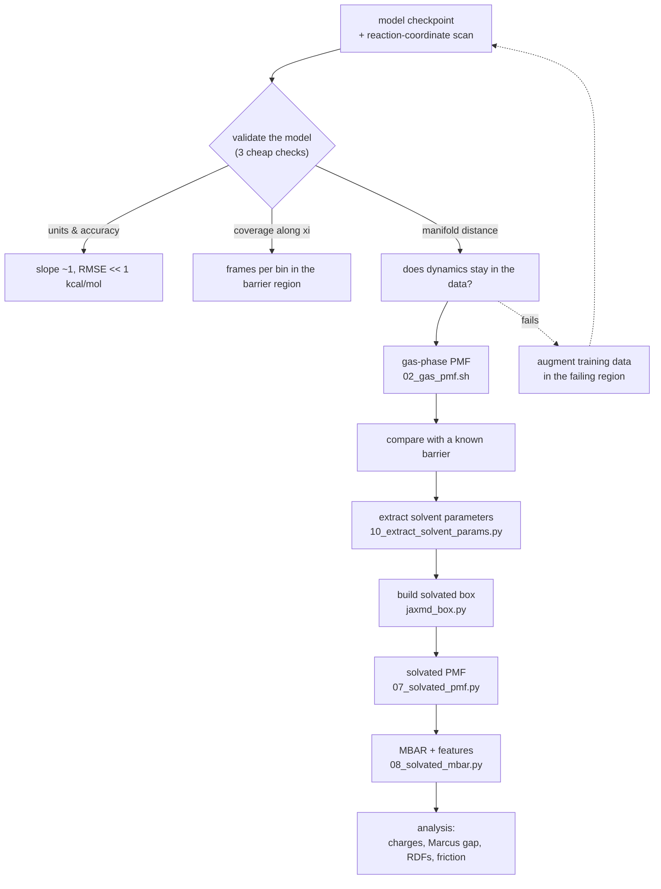

# Menshutkin reaction: reactive ML/MM free-energy campaign

NH₃ + CH₃Cl → CH₃NH₃⁺ ··· Cl⁻ in the gas phase and in five solvents, with a
PhysNet potential for the reacting solute and CGenFF for the solvent, sampled
with JAX-MD.

The scientific target is the relationship between **bond reorganisation** and
**solvent reorganisation**: how the barrier drops from ~36 kcal/mol in vacuum to
~18 in water, and how fast the solvent has to move to make that happen. The
reference point is Turan, Brickel & Meuwly (2022) — see
[Literature](#literature) — which did the same reaction with a fitted reactive
force field. What is new here is a machine-learned surface with **fluctuating
charges**, which gives access to the electrostatic and dynamical observables that
work could not measure.

> **Status:** the pipeline is complete and fast (105 steps/s, 83 s per umbrella
> window) — gas-phase PMF, fluctuating-charge electrostatic embedding, all five
> solvents at experimental density, CHARMM-free at runtime.
>
> **But no PMF from the current checkpoint should be quoted.** The solvated
> solute samples 1.2–1.9 Å outside its training data from the first frame, and
> runs die in the barrier region. See
> [the audit](#where-this-stands-against-the-plan--an-honest-audit). The model
> needs augmenting; the machinery around it is ready and waiting.

---

## Contents

1. [Quick start](#quick-start)
2. [Background: what we are computing and why](#background-what-we-are-computing-and-why)
3. [Machinery added to `mmml`](#machinery-added-to-mmml)
4. [Files in this directory](#files-in-this-directory)
5. [Running the gas-phase PMF](#running-the-gas-phase-pmf)
6. [Running the solvated campaign](#running-the-solvated-campaign)
7. [Findings that change how you should run things](#findings-that-change-how-you-should-run-things)
9. [Bugs found and fixed](#bugs-found-and-fixed)
10. [Analysis plan](#analysis-plan)
11. [Current status](#current-status)
12. [Resuming after a break](#resuming-after-a-break-or-a-new-session)
13. [Literature](#literature)

---

## Quick start

```bash
cd /mmhome/andreychev/mmml/mmml
source examples/menshutkin/_env.sh
```

`_env.sh` is host-aware and sets everything else. On the login node it selects
CPU and injects an OpenCL shim so PyCHARMM can load; on `gpu09` it picks up the
GPU automatically.

Smoke test the whole gas-phase chain (~2 min on CPU):

```bash
SMOKE=1 bash examples/menshutkin/02_gas_pmf.sh
```

Production run on the GPU host:

```bash
ssh gpu09 /mmhome/andreychev/mmml/mmml/examples/menshutkin/run_gas_gpu.sh
```

### Hosts

| Host | GPU | PyCHARMM | Use for |
|---|---|---|---|
| login node | none (`cuInit` fails) | needs the OpenCL shim | editing, smoke tests, analysis |
| `gpu09` | 2 × RTX 5090, 32 GB | works natively | all production runs |

`gpu09` GPU 0 is often occupied by someone else, so `_env.sh` defaults to
`CUDA_VISIBLE_DEVICES=1`. Override if you check `nvidia-smi` and 0 is free.

There is a Slurm `gpu` partition (`gpu[01-26]`), but we drive `gpu09` directly
over ssh — it is simpler and the jobs are short enough not to need queueing.

#### The OpenCL shim

`libcharmm.so` links against `libOpenCL.so.1`, which is **not installed on the
login node**, so `import pycharmm` failed with `OSError: libOpenCL.so.1: cannot
open shared object file`. All fifteen OpenCL symbols CHARMM references are
functions (no data symbols), so a no-op stub satisfies the dynamic linker
without changing behaviour — CHARMM only calls them from its explicit OpenCL
acceleration path, which `mmml` never enables.

The stub lives at `~/.local/opencl-stub/libOpenCL.so.1` and `_env.sh` prepends
it to `LD_LIBRARY_PATH` **only on hosts with no real OpenCL**. `gpu09` has a
genuine `/usr/lib/x86_64-linux-gnu/libOpenCL.so.1` and is left alone.

To rebuild it (source is in the session scratch; reproduce with any 15 no-op
functions plus a version script exporting `OPENCL_1.0`):

```bash
gcc -O0 -fPIC -shared -o ~/.local/opencl-stub/libOpenCL.so.1 oclstub.c \
    -Wl,--version-script=oclstub.map -Wl,-soname,libOpenCL.so.1
```

---

## Background: what we are computing and why

### The reaction

The Menshutkin reaction is an Sₙ2 methyl transfer that creates charge from
neutral reactants:

```
NH₃ + CH₃Cl  →  [H₃N···CH₃···Cl]‡  →  CH₃NH₃⁺ ··· Cl⁻
```

This makes it an unusually clean probe of solvation. The reactants are neutral
and weakly interacting; the products are an ion pair. A polar solvent therefore
stabilises the product far more than the reactant, which pulls the barrier down
dramatically. Turan et al. measured a spread of ~16 kcal/mol across solvents
(35.8 in vacuum → 18.0 in water). It is also the standard model for
SAM-dependent biological methylation, which is why enzyme people care.

### The reaction coordinate

Following Turan et al. we use the **antisymmetric stretch**

```
ξ = r(C–Cl) − r(C–N)
```

Reactants sit at ξ ≈ −1.5 Å (C–Cl bonded, N far), products at ξ ≈ +1.5 Å (C–N
bonded, Cl leaving), and the transition state near ξ ≈ 0.

**A warning about this coordinate.** ξ does *not* determine a geometry. The pair
(r(C–Cl), r(C–N)) = (1.8, 3.0) and (8.1, 7.3) give almost the same ξ, but the
second is a dissociated system. On a physical potential the second costs bond
energy and is never visited. On a *fitted* potential it may not be — see
[Findings](#findings-that-change-how-you-should-run-things). This bit us.

### Extending past the contact ion pair

Turan et al. stopped at ξ = +1.6 Å, which reaches the **contact ion pair** and
no further. We want the profile continued through

```
contact ion pair  →  solvent-separated ion pair  →  free solvated ions
```

because that is where the solvation shell around Cl⁻ actually forms, and it is
the part of the free-energy surface that distinguishes the solvents most
sharply. Practical consequences:

- **Window range is capped at ξ ≈ +6.0 Å by the model's cutoff.** See
  [the ion-separation scan](#how-far-can-the-model-separate-the-ions) below.
  ξ ≈ r(C–Cl) − 1.5 out there, so ξ = +6.0 Å is r(C–Cl) = 7.5 Å. That still
  covers CIP, the desolvation bump and SSIP; it does **not** reach free ions.
- **Box size.** Ions must not see their own periodic images. With a 30 Å box the
  usable separation is ~12–13 Å; beyond that the box has to grow.
- **Seeds.** The scan only reaches ξ = 4.12 Å. Past that, seeds are generated by
  pulling Cl⁻ along the C–Cl axis, which is a clean dissociation and needs no
  new sampling.
- **Expect a long flat tail** in polar solvents (the ions are screened and the
  PMF flattens once each has its own shell) and a *rising* tail in cyclohexane,
  where nothing screens the Coulomb attraction. That contrast is itself a
  result worth plotting.

### How far can the model separate the ions?

Scanning the ML surface with Cl pulled along the C–Cl axis
(`artifacts/menshutkin/diag/scan_ion_separation.py`):

| r(C–Cl) (Å) | ξ (Å) | E_rel (kcal/mol) | q(Cl) (e) | q(rest) (e) | \|μ\| (e·Å) | dist to training (Å) |
|---|---|---|---|---|---|---|
| 2.00 | +0.48 | 0.0 | −0.540 | +0.707 | 2.09 | 0.30 |
| 2.75 | +1.23 | **−61.1** | −0.829 | +0.817 | 3.30 | 0.19 |
| 4.25 | +2.73 | −43.2 | **−0.907** | +0.903 | 4.92 | 0.21 |
| 6.00 | +4.48 | −28.8 | −0.844 | +0.820 | 5.93 | 0.41 |
| 7.50 | +5.98 | −24.1 | −0.777 | +0.783 | 6.74 | 0.30 |
| **8.00** | **+6.48** | **+592.5** | −0.692 | **+8.583** | **48.4** | 0.49 |
| 12.00 | +10.48 | +603.9 | −0.721 | +8.643 | 68.3 | 1.37 |

**Up to r(C–Cl) = 7.5 Å the model behaves correctly.** A real ion pair forms:
q(Cl) reaches −0.91, charge is conserved (q_Cl + q_rest ≈ 0), the dipole grows
linearly as q·r should, the energy climbs out of the contact-ion-pair minimum at
2.75 Å against the unscreened Coulomb attraction, and every geometry stays well
inside the training manifold (0.17–0.50 Å, against a training spacing of
0.35 Å median).

**At r(C–Cl) = 8.0 Å it breaks completely.** The energy jumps by 600 kcal/mol,
the dipole to 48 e·Å, and — the giveaway — **total charge stops being
conserved**: q(rest) leaps from +1.0 to +8.6 e. Past 8 Å the profile is
perfectly flat, i.e. the model has stopped responding to geometry at all.

The cause is structural, not a data gap: **the model's cutoff is 8.0 Å**
(`cutoff: 8.0`, `electrostatics_off_start: 8.0`). Beyond it the chloride has no
neighbours left in the message-passing graph, becomes an isolated atom, and the
charge-partitioning machinery has nothing to work with. Note the
distance-to-training metric stays small throughout — this failure is invisible
to an extrapolation check, which is why it needs its own guard.

Consequences:

- Cap window centres at **ξ = +6.0 Å**. Anything beyond is fiction.
- The interesting structure (CIP at r ≈ 3–4 Å, SSIP at r ≈ 5–7 Å in water) is
  inside the valid range, so the CIP → bump → SSIP sequence is reachable.
- True free ions are **not** reachable without retraining at a larger cutoff, or
  bolting an analytic fragment–fragment Coulomb term onto the separated regime.

### Can the two ions be described separately past the cutoff?

The obvious repair for the 8 Å spike is to stop asking the model for a dimer:
keep it for CH₃NH₃⁺···Cl⁻ up to the cutoff, and past that evaluate each ion on
its own and add the Coulomb between them. It is the right instinct, and the
model *has* seen thermally sampled geometries, so the fragments themselves would
not be exotic. It does not work with **this checkpoint**, for three reasons —
and the third is the one that matters.

**It cannot evaluate a lone atom.** Chloride is one atom, one atom has no pairs,
and `e3x.ops.sparse_pairwise_indices(1)` returns empty index arrays, so the
radial basis reduces over an empty axis and raises before any energy is
computed. There is no isolated-Cl⁻ energy to be had.

**It cannot be told a fragment is charged.** The checkpoint has
`total_charge: 0.0` in its config. Asked for CH₃NH₃ alone it describes the
*neutral* species, not the cation. The fragment energies would be the wrong
chemistry, so their sum would not be the ion-pair asymptote.

**The charges are already decaying well before the cutoff** — and this is the
finding that constrains any repair, not just this one.
`artifacts/menshutkin/diag/tail_charge.py` compares the charge the model
*predicts* on the chloride against the charge implied by its *energy*, via
dE/d(1/r) = 332·q₊q₋ for a monopole pair:

```
    window (A)  q_from_energy  q_predicted
   3.5-  4.4          0.815        0.902
   4.5-  5.4          0.821        0.883
   5.5-  6.4          0.690        0.840
   6.5-  7.4          0.625        0.797
   7.0-  7.9          3.200        0.787
```

The physical answer is 1.000 everywhere past contact: once the ion pair exists
there is nothing else left in the interaction. Instead both measures fall away
steadily from ~5 Å, and by 6.5–7.4 Å the energy behaves like a pair carrying
0.63 e. The last row's 3.2 is the switching function turning off, not physics.

So the model does not break *at* 8 Å; it **degrades continuously from about 5 Å**
as the chloride's neighbourhood empties out. The trustworthy region is narrower
than the cutoff suggests. That is why splicing anything on at the cutoff cannot
be made to work: there is nowhere to anchor it. Where the interaction is finally
pure monopole, the model has already lost the charge; where the charge is still
right (~4–4.5 Å), the interaction is not yet pure monopole — an analytic tail
fitted at 7.0 Å leaves a residual spanning 3.2 kcal/mol over r ≥ 5 Å
(`coulomb_tail.py`).

**What this means for the solvated PMF beyond the CIP.** The decay is not only an
energy problem. `ml_mm_elec` feeds these same charges to the solute–solvent
Coulomb, so a chloride the model has quietly discharged to 0.79 e is also
*solvated* too weakly — precisely in the SSIP region the campaign is aimed at.
This affects results inside the current ξ ≤ +6.0 Å cap, not merely beyond it.

**Options, least to most work:**

1. **Report CIP only**, capping windows where the charge is still sound
   (r(C–Cl) ≲ 5 Å, ξ ≲ +3.5 Å). Honest, and needs nothing new.
2. **Splice with the physical charge**, not the model's: continue from
   r_ref ≈ 4.5–5 Å as E(r) = E_model(r_ref) + 332·(−1)·(1/r − 1/r_ref), and clamp
   the embedding charges to ±1 past r_ref too. Reaches the SSIP, but it is a
   *correction to the model* and must be labelled as one on any plot.
3. **Retrain at a larger cutoff** (12 Å), which is the only option that fixes the
   cause. This is the one to do if the SSIP region is going into the talk.

### Free energy from umbrella sampling

The barrier is >20 kcal/mol, so direct sampling never crosses it. Instead we
restrain ξ to a ladder of window centres ξ₀ with a harmonic bias

```
W(R) = ½ k (ξ(R) − ξ₀)²
```

run each window independently, and recombine with MBAR to get the unbiased
potential of mean force F(ξ). Turan et al. used ξ ∈ [−1.3, 1.6] Å with 0.1 Å
spacing (~30 windows), k = 150 kcal/mol/Ų, 50 ps per window with 5 ps
equilibration discarded. We reproduce that protocol; k = 150 kcal/mol/Ų is
6.505 eV/Ų in the units this code uses.

**Reading the diagnostics.** Two numbers decide whether a PMF means anything:

- *Neighbouring-window histogram overlap.* MBAR reweights between windows, so
  adjacent windows must share configurations. Below ~0.03 it is extrapolating.
  `03_gas_report.py` prints this.
- *Effective sample count* (`N_k_effective`). Frames within a window are
  correlated; MBAR subsamples to independent ones. Fewer than ~20 per window
  means the error bars are not trustworthy regardless of what they say.

### ML/MM decomposition

The solute (9 atoms) is described by PhysNet; the solvent by CGenFF; the
coupling by electrostatics + Lennard-Jones. Concretely:

```
E = E_ML(solute)                    reactive, from model_ext.json
  + E_MM,bonded(solvent)            keeps solvent molecules intact
  + E_MM,nonbonded(intermolecular)  solvent–solvent and solute–solvent
  + W(ξ)                            umbrella bias
```

Two things are easy to get wrong here and both are handled explicitly:

1. **The solute must be one ML group, not two.** The default `ml_intra` term
   evaluates each *molecule* separately. That would compute NH₃ and CH₃Cl in
   isolation, and no reaction could occur. The solute has to be a single 9-atom
   ML unit.
2. **CGenFF bonded terms inside the ML region must be deleted.** CGenFF gives
   CH₃Cl a harmonic C–Cl bond with k ≈ 220 kcal/mol/Ų. Left in place alongside
   PhysNet it both double-counts and pins the leaving group, so the chloride can
   never depart. The `mm_bonded` term drops every bond/angle/torsion/improper
   touching an ML atom (this is the JAX equivalent of the `delete bond` lingo
   the PyCHARMM ADUMB path issues).

---

## Machinery added to `mmml`

All of it is shared between the gas and solvated paths on purpose: a reaction
coordinate defined twice would silently produce two incomparable profiles.

| Component | Location | What it does |
|---|---|---|
| `LinearDistanceCV` | `mmml/md/restraints/linear_distance.py` | ξ = Σ cᵈ·r(iᵈ,jᵈ) with analytic gradients, MIC-aware. `LinearDistanceCV.difference((C,Cl),(C,N))` is the Sₙ2 coordinate |
| `FlatBottomWall` | same file | One/two-sided confinement on any CV; zero inside the bounds |
| `mm_bonded` | `mmml/md/energy/terms/mm_bonded.py` | CGenFF bonded energy for MM molecules, filtering out ML-region rows |
| `rxncoor` | `mmml/md/energy/terms/rxncoor.py` | Umbrella bias on a `LinearDistanceCV` for solvated windows |
| combination CVs | `mmml/umbrella/*` | Threaded through config, packed energies/forces, seeding, snapshots and MBAR |
| `equilibration_steps` | `mmml/umbrella/config.py` | Discards leading frames; window seeds are 0 K optimised geometries, so the start of every run is a heating transient |

Backward compatibility is covered: all 62 pre-existing umbrella tests still
pass, and dedicated tests assert that a single-pair `LinearDistanceCV`
reproduces the old distance-umbrella energies and forces bit for bit.

### Tests

```bash
uv run --with pytest python -m pytest \
  tests/unit/test_md_linear_distance_cv.py \
  tests/unit/test_md_rxncoor.py \
  tests/unit/test_md_mm_bonded.py \
  tests/unit/test_umbrella_combination_cv.py \
  tests/unit/test_umbrella_*.py tests/unit/test_md_restraints.py -q
```

103 tests, all passing. Note `tests/unit/test_gui_api_frontend_fallback.py` fails
to *collect* on this machine (missing `httpx2`); unrelated, pass
`--ignore=tests/unit/test_gui_api_frontend_fallback.py` when running the full
suite.

---

## Files in this directory

### The live pipeline

| file | what it is for |
|---|---|
| `_env.sh` | **Source this first.** Host-aware environment: picks GPU vs CPU, injects the OpenCL shim where needed, sets checkpoint/scan/artifact paths and the reaction-coordinate defaults |
| `solute.py` | Everything specific to *what is reacting*: atom layout, the two atom orderings and their CV indices, scan loading, geometry seeding, model loading. **Swap this file to change reaction.** |
| `solvent_models.py` | Solvent force-field parameters as explicit data. Loads anything in `solvent_params/` automatically |
| `jaxmd_box.py` | Builds the solvated system in numpy/JAX-MD — solute at centre, solvent on a jittered lattice with acceptance testing, compressed to experimental density. Asserts its contacts before returning |
| `gpu_pairs.py` | Static on-device pair list. Replaces the host neighbour list; the reason runs go at 100+ steps/s instead of 2.5 |
| `01_seed_windows.py` | Picks one geometry per umbrella window from the reaction-coordinate scan (gas phase) |
| `02_gas_pmf.sh` | Gas-phase driver: seed → packed umbrella → MBAR → report |
| `03_gas_report.py` | Gas PMF profile, barrier, TS position, sampling diagnostics, figure |
| `07_solvated_pmf.py` | **The solvated campaign.** Builds the box, walks windows outward from ξ = 0, writes ξ(t) per window (incrementally, so progress is inspectable) |
| `08_solvated_mbar.py` | MBAR from ξ(t) alone; detects barrier / CIP / desolvation bump / SSIP; writes the PMF figure |
| `10_extract_solvent_params.py` | Uses CHARMM **once, offline** to write one solvent's parameters to JSON |
| `11_extract_all_solvents.sh` | Runs the above for all campaign solvents, one subprocess each |
| `run_gas_gpu.sh` | Launches the gas run on the GPU host with logging |
| `top_mecl.rtf`, `top_chex.rtf` | CGenFF append residues: chloromethane under a 4-character name, and cyclohexane re-typed for CGenFF. Still needed by the parameter extraction |
| `solvent_params/*.json` | Extracted solvent parameters, read at runtime |
| `figures/` | README figures, regenerated by `artifacts/menshutkin/diag/make_figures.py` |
| `legacy/` | The superseded CHARMM box-building route, kept for the findings it documents. Nothing live uses it — see `legacy/README.md` |

### Diagnostics (`artifacts/menshutkin/diag/`)

Not part of the pipeline; run them when a number looks wrong. Each answers one
question and each caught a real problem here.

| script | question it answers |
|---|---|
| `manifold_distance.py` | is sampled configuration space inside the training data? |
| `solvated_manifold.py` | same question, for a solvated window — plus the solute's ML energy per frame |
| `scan_ion_separation.py` | do the charges stay physical out to the largest separation? |
| `check_all_solvents.py` | do all five boxes build at the right density with sane energies? |
| `profile_solvated.py` | where is the time going, host or device? |
| `trace_nvt.py` | at which step does a run go non-finite, and with which terms? |
| `make_figures.py` | regenerates the README figures |
| `scan_xh.py`, `find_hole.py`, `trace_blowup.py` | gas-phase blow-up forensics |
| `check_packmol.py`, `check_carved.py`, `check_dupes.py`, `check_padding.py` | forensics on the retired CHARMM box route |

---

## The workflow



**For a new model or a new system**, the only files that should need editing are
`solute.py` (what reacts, the CV, the atom layout) and `solvent_models.py` /
`solvent_params/` (what it is dissolved in). Everything else is generic. The
step-by-step version with all the traps is in
[Reproducing this for another system](#reproducing-this-for-another-system).

---

## Figures

### Is the model usable?


Left: the gas-phase ML energy as Cl is pulled away. It behaves correctly to
r(C–Cl) = 7.5 Å and then breaks at the model's 8 Å cutoff. Right: the charge
separation that makes this reaction interesting — q(Cl) reaches −0.91 e — and
the giveaway that the break is structural rather than statistical: **total
charge stops being conserved** past the cutoff.

### Why the checkpoint choice matters


Training frames per 0.25 Å bin along the reaction coordinate. `kl.json` has
essentially nothing in the transition-state region, so a barrier from it is
meaningless. `model_ext.json` covers it — but thinly, which is the root of the
sampling problem described in
[Findings](#findings-that-change-how-you-should-run-things).

---|---|
| `_env.sh` | Host-aware environment. Source this first, always |
| `01_seed_windows.py` | Picks one geometry per umbrella window from the RC scan |
| `02_gas_pmf.sh` | Gas-phase driver: seed → umbrella → MBAR → report |
| `03_gas_report.py` | PMF profile, barrier, TS position, sampling diagnostics, figures |
| `04_make_solvent_boxes.sh` | Solvates the solute in the five Turan solvents |
| `05_export_solute.py` | Strictly formatted CGenFF solute PDB + atom-order mapping |
| `run_gas_gpu.sh` | Launches the gas run on `gpu09` with logging |
| `top_mecl.rtf` | Chloromethane as a 4-character residue (`MECL`) |
| `top_chex.rtf` | Cyclohexane re-typed for CGenFF (`CHEX`) |

Diagnostic scripts that reproduce the failures described below live in
`artifacts/menshutkin/diag/`.

### Two atom orderings — read this before indexing anything

There are unavoidably two atom orders, and the CV indices differ between them:

| Order | Layout | CV flag |
|---|---|---|
| **canonical** (ML seeds, `01_seed_windows.py`) | Cl, N, C, H(N)×3, H(C)×3 | `--cv-difference 2,0,2,1` |
| **PDB/PSF** (`05_export_solute.py`, solvated) | AMM1: N,H,H,H then MECL: C,CL,H,H,H | `--cv-difference 4,5,4,0` |

The PDB order exists because CHARMM builds a PSF by reading the sequence from
the PDB, which requires each residue's atoms to be contiguous. The canonical
order interleaves the two residues, and Packmol responds by renumbering the
split residue to 9999. `05_export_solute.py` writes the permutation between the
two orders to `solute_amm1_mecl.json`, so nothing downstream has to re-derive it.

### Residue naming

Stock CGenFF is missing two things we need:

- **Chloromethane.** `examples/m` defines it as `RESI CH3CL`, five characters.
  The PDB residue-name field is columns 18–21 — four characters — so that file
  had to be written with shifted columns, which strict readers (ASE, and hence
  `mmml make-box`) reject with *"Invalid or missing coordinate(s)"*. We use
  `MECL` instead. Parameters are keyed by atom type, so
  `examples/m/par_ch3cl.prm` applies unchanged.
- **Cyclohexane.** The only cyclohexane in the CHARMM tree is in
  `top_all35_ethers.rtf`, typed with legacy ether types `CC32A`/`HCA2A`. Pulling
  that in would mix two force fields, so `top_chex.rtf` re-types the same
  molecule with CGenFF `CG321`/`HGA2`, which are fully parameterised in stock
  `par_all36_cgenff.prm` (no extra parameter file needed).

---

## Running the gas-phase PMF

```bash
source examples/menshutkin/_env.sh
bash examples/menshutkin/02_gas_pmf.sh
```

Three stages:

**1. Seed the windows** (`01_seed_windows.py`). Each window starts from the scan
geometry closest to its ξ₀. Stretch-seeding cannot build these: the methyl group
inverts (Walden inversion) between reactant and product, and no rigid
translation reproduces that. The script fails loudly if any window's nearest
scan frame is more than 0.06 Å off target — currently the worst is 0.005 Å.

**2. Umbrella sampling.** All 30 windows are packed into a single JAX-MD system
and propagated together, which is what makes the gas phase cheap. Windows are
provably independent — verified by moving one window 1000 Å away and confirming
the others' energies and forces change by <3×10⁻¹⁴. Replica exchange between
neighbouring windows is on (acceptance ~0.3).

**3. MBAR + report** (`03_gas_report.py`). Writes `pmf_profile.json` and
`pmf_gas.png`, and prints the diagnostics described above.

### Knobs

| Variable | Default | Note |
|---|---|---|
| `DT_FS` | 0.25 | See the timestep discussion below |
| `NSTEPS` | 220000 | 55 ps |
| `EQUIL` | 20000 | 5 ps discarded, matching Turan |
| `SAVEFREQ` | 100 | 2000 production frames/window |
| `MENSH_N_WINDOWS` | 30 | |
| `MENSH_K_EV` | 6.505 | = 150 kcal/mol/Ų |
| `SMOKE=1` | off | 0.5 ps, for checking the plumbing |

### Result so far

From a short (0.5 ps/window) run — **statistics too poor to quote**, but the
shape is right:

| | this work (smoke) | Turan et al. |
|---|---|---|
| barrier | 31.9–33.5 kcal/mol | 35.8 |
| TS position | ξ = +0.80 Å | late |

The profile rises monotonically to a late, product-like transition state and
then flattens — correct for the gas phase, where the "barrier" is essentially
the endothermicity of forming the contact ion pair.

---

## Running the solvated campaign

```bash
source examples/menshutkin/_env.sh
bash examples/menshutkin/04_make_solvent_boxes.sh          # production boxes
SMOKE=1 bash examples/menshutkin/04_make_solvent_boxes.sh  # 12 molecules, L=20 Å
SOLVENTS="water:TIP3:997:30" bash examples/menshutkin/04_make_solvent_boxes.sh
```

Solvent set and box sizes follow Turan et al.; molecule counts come from
experimental densities at 298 K rather than being hand-set, so boxes start near
the right density:

| Solvent | CGenFF residue | ρ (kg/m³) | box (Å) | Turan barrier (kcal/mol) |
|---|---|---|---|---|
| water | `TIP3` | 997 | 30 | 18.0 ± 0.5 |
| methanol | `MEOH` | 792 | 25 | 20.5 |
| acetonitrile | `ACN` | 786 | 28 | 20.6 |
| benzene | `BENZ` | 874 | 27 | 24.1 |
| cyclohexane | `CHEX` | 774 | 30 | 33.9 ± 1.4 |
| *(gas phase)* | — | — | — | 35.8 |

That ladder — polar protic → polar aprotic → aromatic → apolar — is the point:
cyclohexane is the "no catalysis" control that makes the solvent effect legible.

The box is built around a **transition-state-like solute** (ξ ≈ 0). The umbrella
windows re-seed the solute anyway, but equilibrating the shell around the
charge distribution that actually matters beats starting from a neutral pair
that then has to reorganise.

### Embedding: the planned A/B

Two levels, run side by side on at least one solvent:

- **Mechanical** — solute–solvent via fixed CGenFF charges + LJ. The solvent
  cannot respond to charge separation, so this should badly under-catalyse.
- **Electrostatic** — solute–solvent Coulomb uses PhysNet's *fluctuating*
  charges q_i(R), which change as the ion pair forms. This is the physics that
  drives solvent reorganisation and is what enables the Marcus analysis.

The difference between the two is a clean, quotable measure of how much of the
catalysis is electrostatic. (Not yet implemented — see
[Current status](#current-status).) The charge model is being designed to be
pluggable so **DCM** (distributed charge model, `mmml/models/dcmnet`) can be
swapped in: off-centre distributed charges reproduce the molecular ESP much
better than atomic point charges, which matters most exactly where this project
is aimed — the developing chloride charge and the solvent's response to it.

---

## Reproducing this for another system

This section is the point of the README: everything above is one worked example
of a general recipe. What follows is what you actually have to change, in order,
with the traps that cost time here called out where they apply.

The recipe assumes your reaction is describable as **a small reactive solute in
an unreactive solvent**, which is the regime this stack targets.

### Step 0 — what you need before starting

| Ingredient | For the Menshutkin case | How to check it |
|---|---|---|
| Trained ML potential covering the whole reaction path | `model_ext.json`, PhysNet, 9 atoms | see Step 2 |
| A reaction coordinate | ξ = r(C–Cl) − r(C–N) | see Step 1 |
| Reference geometries along that coordinate | `scan_nh3_ch3cl.npz`, 2500 frames | used to seed windows |
| Solvent force-field parameters | CGenFF via `10_extract_solvent_params.py` | Step 4 |
| A GPU | `gpu09` | `nvidia-smi` |

### Step 1 — define the reaction coordinate

Anything expressible as a linear combination of interatomic distances works:

```python
from mmml.md.restraints import LinearDistanceCV

cv = LinearDistanceCV.difference(minuend=(iC, iX), subtrahend=(iC, iN))   # SN2
cv = LinearDistanceCV.distance(i, j)                                      # dissociation
cv = LinearDistanceCV(pairs=((a, b), (c, d)), coefficients=(1.0, 1.0))    # a sum
```

**Trap: a difference of distances does not determine a geometry.** ξ = r₁ − r₂
is satisfied by (1.8, 3.0) *and* by (8.1, 7.3) — the second is a dissociated
system. On a real potential that costs bond energy and never happens; on a
fitted one it can be *downhill*. If your CV is a difference, either wall the
corresponding **sum** with `FlatBottomWall`, or verify (as in Step 2) that your
model does not have a hole out there. We lost a day to this.

### Step 2 — check your model before you trust any free energy

Three checks, all cheap, all of which caught a real problem here. Scripts are in
`artifacts/menshutkin/diag/`.

**2a. Units and accuracy.** Predict the reference set and regress:

```
slope 0.9988, RMSE 0.0020 eV = 0.046 kcal/mol   <- good
```

Also confirm what the energies *are*: ours span −15139…−15136 eV, i.e. absolute
MP2 total energies in eV, not relative kcal/mol.

**2b. Training coverage along the coordinate.** Histogram your training set in ξ.

```
basins:        400–900 frames per 0.25 Å bin
barrier region: 55–110 frames per 0.25 Å bin   <- thin
```

A different checkpoint here (`kl.json`) had **4 frames** across the entire
transition-state region. Any barrier from it is meaningless, and nothing warns
you.

**2c. Does dynamics stay on the training manifold?** This is the one people
skip. Run short biased MD in each window and measure the distance from each
sampled configuration to its nearest training frame, in a permutation-invariant
fingerprint (sorted pairwise distances). Compare against the *spacing between
training frames themselves*:

```
training nearest-neighbour spacing:  median 0.349 Å, p90 0.826 Å
basin windows:                       median 0.24–0.54 Å   <- fine
barrier windows xi = 0.00, +0.50:    median 1.67, 2.30 Å; p90 25 710, 151 123 Å
```

Those last two escaped and ran away to −275 eV, 5641 kcal/mol below anything in
training. `manifold_distance.py` does this.

**Trap: a smaller timestep will not save you.** Cutting dt 0.25 → 0.05 fs only
delayed onset proportionally, and raising the friction 10× likewise. That
scaling is the signature of a thermally activated escape off the data manifold,
not an integration instability. If halving dt does not qualitatively change
things, stop tuning the integrator and go look at the model.

**2d. Range limits.** If your reaction separates fragments, scan out to the
separation you need and watch the predicted charges. Ours is fine to
r(C–Cl) = 7.5 Å and then breaks completely at 8.0 Å — which is exactly the
model's cutoff. Past it the fragment leaves the message-passing graph, **charge
conservation fails** (q(rest) jumped from +1.0 to +8.6 e) and the energy stops
responding to geometry. Note this failure is *invisible* to the
distance-to-training metric in 2c, so it needs its own check.

### Step 3 — gas phase first, always

```bash
SMOKE=1 bash examples/menshutkin/02_gas_pmf.sh    # plumbing, ~2 min
bash examples/menshutkin/02_gas_pmf.sh            # production
```

The gas phase is cheap (all windows packed into one JAX-MD system) and validates
the CV, the bias, the seeding and the MBAR pipeline before any solvent cost.
Compare against a literature barrier or your own NEB.

To adapt: change `MENSH_CV_DIFFERENCE`, `MENSH_XI_MIN/MAX`, `MENSH_N_WINDOWS`
and `MENSH_K_EV` in `_env.sh`, and point `MENSH_SCAN` at your own scan.

### Step 4 — solvent parameters

```bash
python examples/menshutkin/10_extract_solvent_params.py \
    --residue MEOH --name methanol --density 792 --box-side 25
```

CHARMM is used **once, offline** to resolve geometry, charges, LJ and harmonic
bonded terms into `solvent_params/<name>.json`; `solvent_models.py` picks up
anything in that directory automatically, so adding a solvent needs no code
edit. Everything after this point is pure numpy/JAX-MD.

Densities are experimental values at 298 K — look them up; they set the box.

**Trap: CHARMM builds exactly one system per process.** A second
`build_packmol_composition_cluster` in the same process leaves CHARMM
inconsistent (`SOME COORDINATES NOT BUILT`, `CCNBA not allocated`) and then
hard-exits with no traceback. Loop with one subprocess per solvent.

**Trap: a CHARMM RTF title block ends at the first line containing only `*`.**
If you write an append residue with explanatory paragraphs separated by bare
`*` lines, CHARMM parses the rest of your header as RTF commands and dies with
`ABNORMAL TERMINATION / MOST SEVERE WARNING WAS AT LEVEL 0` and nothing else.
This silently broke both `make-box` and the composition builder here. Keep the
title to one contiguous block with a single terminating `*`.

### Step 5 — build the solvated box

`jaxmd_box.py` places the solute at the box centre, fills the rest with solvent
on a jittered lattice using an explicit atom-level acceptance test, then
compresses the box so the molecules actually placed give the experimental
density. It **asserts the minimum intermolecular distance before returning**, so
a bad configuration cannot reach the integrator.

Three traps, all of which produced garbage energies here:

- **Lattice spacing must match the physical molecular separation**, (V/N)^(1/3).
  Over-provisioning sites drove water's spacing to 2.2 Å (it needs ~3.1 Å) and
  every molecule sat on its neighbour's repulsive wall: +1220 eV.
- **Blind placement is not enough** — you need a per-molecule acceptance test.
  Set the threshold from chemistry, not from a generic "no atoms closer than
  2.2 Å": a water hydrogen bond puts H···O at ~1.8 Å, so demanding 2.2 Å forbids
  the structure you are trying to build. We use 1.95 Å.
- **The box must be at least twice the nonbonded cutoff**, or the minimum-image
  convention is violated and pairs are counted through periodic images. The
  builder now refuses. A 20 Å box with a 12 Å cutoff is wrong.

Do **not** try to make room for the solute by moving solvent aside. At liquid
density there is nowhere to move to: random relocation left 431 of 461 waters
clashing, and radial pushing ended with two atoms exactly coincident and
E = −9×10⁵ eV. Delete overlapping solvent instead — a topology depends only on
residue *counts*, so you can rebuild it for the surviving count and drop the
coordinates in.

### Step 6 — compose the energy

```
E = ml_intra      (the solute, as ONE ML group)
  + mm_bonded     (solvent only; ML-region rows deleted)
  + mm_nonbonded  (intermolecular; solute is one molecule)
  + ml_mm_elec    (solute-solvent Coulomb from fluctuating ML charges)
  + rxncoor       (the umbrella bias)
```

Four things are easy to get wrong, and the stock `md-system` path gets three of
them wrong for a reactive solute (it returns E₀ = −1.5×10⁶ eV on a water box):

1. **The ML solute must be one group, not one group per molecule.** The default
   `ml_intra` scores each *molecule* separately, so your two reactants would be
   evaluated in isolation and no reaction could occur. Pass
   `monomer_indices=[all_solute_atoms]`.
2. **Do not let the ML model see the solvent.** A 9-atom solute model asked for
   a water molecule returns nonsense.
3. **Delete force-field bonded terms inside the ML region.** CGenFF gives CH₃Cl
   a harmonic C–Cl bond with k ≈ 220 kcal/mol/Ų. Left in, it both double-counts
   and pins the leaving group, so the reaction cannot happen. `mm_bonded`'s
   `ml_atoms` argument drops every row touching the ML region.
4. **Merge the solute into one `mol_id`**, or `mm_nonbonded` adds Coulomb and LJ
   across the bond being formed — an interaction the ML model already describes.

### Step 7 — electrostatic embedding

This is what makes solvent reorganisation happen, and it is the part a fixed
force field cannot do. `ml_mm_elec` predicts the solute's charges from the model
at every step, so they change along the reaction coordinate.

**Set the solute's MM charges to zero** (`solute_charges="ml"` in the builder)
or `mm_nonbonded` double-counts the solute electrostatics. The term refuses to
build otherwise rather than silently adding them twice. Zeroing the charges
removes exactly the Coulomb part and leaves the solute's Lennard-Jones intact.

Because the charges depend on coordinates, **dq/dR contributes to the force**.
The energy is written as a plain function of R and forces come from `jax.grad`
over the whole expression, so that term is included automatically; a
hand-written force differentiating only 1/r would be missing real physics.
There is a unit test asserting exactly this.

Use `charge_mode="q0"` so the ML charges sum exactly to the total charge. Neural
network charges are only approximately conserving, and in a periodic box a small
net charge is a physical error that grows with system size.

Run `--embedding mechanical` as the A/B: fixed charges, so the solvent cannot
respond to charge separation. The difference between the two profiles is a clean
measure of how much of the catalysis is electrostatic.

### Step 8 — run the PMF and analyse

```bash
python examples/menshutkin/07_solvated_pmf.py --solvent water --embedding electrostatic
python examples/menshutkin/08_solvated_mbar.py --run-dir artifacts/menshutkin/pmf/water
```

Windows are walked *outward from ξ = 0* in both directions, each seeded from its
neighbour's final frame, so the solvent shell follows the solute continuously.

Only ξ(t) is stored, not trajectories. For umbrella sampling where every window
shares one Hamiltonian and differs only by the bias, MBAR needs nothing else:
the reduced potentials enter only through differences u_l − u_k = β(W_l − W_k),
which depend on the collective variable alone. That turns MBAR on a 2600-atom
system from a re-evaluation of every frame into arithmetic.

**Always read the two diagnostics** `08_solvated_mbar.py` prints:

- *Neighbouring-window overlap* below ~0.03 means MBAR is extrapolating between
  windows rather than reweighting. Add windows there.
- *Effective sample count* below ~20 per window means the error bars are not
  trustworthy no matter what they say.

### Checklist

```
[ ] model reproduces its reference set (slope ~1, RMSE well under 1 kcal/mol)
[ ] training set covers the barrier region, not just the basins
[ ] short biased MD stays within ~p90 of the training spacing in EVERY window
[ ] if fragments separate: charges still conserved at the largest separation
[ ] gas-phase PMF reproduces a known barrier
[ ] solvent parameters extracted and net-neutral
[ ] box >= 2 x nonbonded cutoff
[ ] built box passes its contact assertion and minimises to a negative energy
[ ] solvent energy per molecule is sane (TIP3P: about -9.9 kcal/mol)
[ ] solute MM charges zeroed when using electrostatic embedding
[ ] window overlap > 0.03 and N_eff > 20 everywhere
```

---

## Where this stands against the plan — an honest audit

Written 2026-07-29, after the first solvated production attempt.

### What is done and verified

| | evidence |
|---|---|
| Reaction coordinate, walls, bias — shared by gas and solvated paths | 115 unit tests, including one asserting the two paths compute the *same* coordinate |
| `mm_bonded` keeps solvent intact and drops ML-region rows | verified it removes exactly the solute's 7 bonds and 9 angles |
| **Fluctuating-charge electrostatic embedding** | 11 tests, including that `dq/dR` enters the force and a numerical-gradient check |
| All five solvent boxes at experimental density | water 997, methanol 792, acetonitrile 786, benzene 874 kg/m³ — all on target |
| CHARMM-free runtime | box builds, minimises to −214 eV, equilibrates to −11.7 kcal/mol per water (TIP3P ≈ −9.9) |
| GPU throughput | 2.5 → **105 steps/s**; 83 s per window |
| Two real unit bugs in `mmml` fixed | jax-md timestep (98x), and the host neighbour list starving the GPU |

### What is NOT done, and two assumptions that turned out wrong

> **This section was rewritten.** It previously blamed the solvated crashes on
> the ML model being out of its training distribution, and stated that the
> training set contained "no thermally distorted geometries". Both claims were
> wrong. What follows is what the measurements actually support; the original
> evidence is kept because it is still informative, but its interpretation has
> changed. See "The solvated blow-up: what it really was" below.

**Wrong assumption 1: that the training set is a bare reaction-path scan.**
It is not — it contains normal-mode-sampled geometries.
`artifacts/menshutkin/diag/manifold_control.py` measures the spread of internal
coordinates among training frames that share a value of ξ, which a rigid scan
would not show at all:

```
      xi bin     n  r(C-H) mean      sd  angle(H-C-H) sd
 -1.50..-1.25   814        1.105  0.0698             5.97
 -0.50..-0.25    71        1.083  0.0272             4.80
 +0.00..+0.25    89        1.078  0.0276             4.79
 +0.50..+0.75   437        1.086  0.0577             6.38
 +1.50..+1.75   157        1.095  0.0220             4.26
```

sd(r C–H) of 0.02–0.07 Å and sd(∠H–C–H) of 4–6° at *fixed* ξ is thermal
sampling, not a scan.

**Wrong assumption 2: that leaving the training manifold caused the crashes.**
It did not. The crashes had a mundane and fixable cause in the ML/MM coupling,
described below. The manifold measurement that follows is still worth reading —
the distances are genuinely larger than the held-out set — but it was recorded
from trajectories that were *already collapsing*, so the numbers are inflated by
the collapse rather than being its cause:

```
xi0 = -0.10, dt = 0.1 fs, training minimum = -30.158 eV
 step   E_total(eV)   E_ML_solute(eV)  dist-to-train(A)   xi
     0       -285.59          -27.342            1.208   -0.283
   300       -278.47          -26.624            0.807   +0.062
   900       -283.80          -27.362            1.424   -0.204
  1400       -291.85          -27.580            1.606   -0.145
  1700       -292.40          -27.887            1.734   -0.113
  1800       -307.66          -24.455            1.767   -0.029
  1900           nan
```

Read the third column against the held-out sets rather than against the training
spacing, which is the control `manifold_control.py` adds:

```
set                              n   median     p90     max   (A)
validation (held out)          600    0.238   0.642   0.944
test (held out)                600    0.246   0.657   1.170
train NN spacing (1/12 sub)    965    0.353   0.844   1.418
```

Solvated frames at 1.2–1.9 Å do exceed the held-out maximum, so the model is
being asked to extrapolate. That remains a caveat on the final numbers. It is
**not** what killed the runs.

### The solvated blow-up: what it really was

Three separate defects, none of them in the model.

**1. Unbounded Coulomb in electrostatic embedding (the actual killer).**
`ml_mm_elec` computed `q_ML * q_MM / r` with no short-range bound. TIP3's
hydrogen has Rmin/2 = 0.2245 Å — essentially no repulsive core — and it works in
pure MM only because it never meets a large negative charge without an oxygen
core alongside. Here it meets a chloride whose ML charge reaches −0.9 e. The
blow-up geometry, dumped by the guard in `07_solvated_pmf.py` and read by
`inspect_blowup.py`, shows exactly that:

```
closest solvent atom to each solute atom, against the LJ contact distance
  solute  q_CGenFF  closest  partner  Rmin_ij  ratio
 Cl[5]     -0.204    1.586  H(solv)    2.135   0.74
  H[7]     +0.059    0.640  H(solv)    1.565   0.41
```

A water hydrogen 1.586 Å from the chloride — 0.55 Å inside contact — having
dragged its own oxygen into the methyl group. Fixed with `erf(r/σ)/r` damping at
σ = 1.0 Å, the same form the learned-charge models in `mmml/models` use. Beyond
1.6 Å it is within 2.5 % of 1/r, so it bounds the singularity without altering
the physical interaction range.

**2. The chlorine had the wrong Lennard-Jones type.** CGenFF's CLGA1
(Rmin/2 = 1.910 Å) describes chlorine bonded to carbon and its small radius is
calibrated against the −0.2 e CGenFF puts there. Over most of this reaction
coordinate the atom is chloride, and CHARMM's chloride CLA has Rmin/2 = 2.270 Å.
Now uses CLA; see the comment in `jaxmd_box.py`.

**3. Minimisation was nowhere near converged, and used the wrong step size.**
The default was 300 FIRE steps from a lattice-packed box at +296 eV. That reaches
≈ −270 eV; 8000 steps reach −376 eV. The consequence was not cosmetic — with 300
steps the residual strain overwhelmed the umbrella restraint, and the window
centred at ξ = 0.00 sampled ⟨ξ⟩ = **+0.94**. Default is now 8000.

Separately, the driver hands FIRE `dt_max` = the **MD** timestep, which is sized
for dynamics on an equilibrated box rather than for descending from a packed one.
At 0.25 fs the minimiser itself diverged on the 30 Å water box while the same
settings were fine at 26 Å — bigger box, more chances to hit a strained contact.
Minimisation now has its own `--minimize-dt-fs`, decoupled from `--dt-fs`, and
runs the first eighth of its steps at a fifth of that to clear the packing strain
before the main pass. Watch for this if you change box size or solvent: it is a
property of the starting configuration, not of the physics.

**The clue that pointed away from the model, and away from the integrator:**
halving the timestep made things *worse*, not better. 0.25 fs died at 11 fs of
simulated time; 0.10 fs survived; 0.05 fs died at 38 fs with a last finite energy
of +2.2 × 10⁷ eV. Genuine integration instability is monotonic in dt. An energy
of +10⁷ eV is a pair of atoms nearly on top of each other, which is what sent us
looking at contact distances.

After all three fixes, at the same dt = 0.25 fs that previously died at 11 fs:

```
  minimise     E      298.311 ->     -374.261 eV
  equilibrate  E     -374.261 ->     -327.417 eV
  w004 xi0=+0.00  <xi>=-0.053 sd=0.022  E=   -299.68 eV
  w005 xi0=+0.25  <xi>=+0.139 sd=0.087  E=   -293.28 eV
  w006 xi0=+0.50  <xi>=+0.308 sd=0.030  E=   -293.26 eV
  ...
  w000 xi0=-1.00  <xi>=-0.840 sd=0.089  E=   -292.19 eV
```

Nine of nine windows finite, and the restraint now holds ξ where it is put.

**A fourth defect, in the diagnostics rather than the physics:** the
"below the training floor" warning compared the *total* box energy against
`TRAIN_MIN_EV = −30.158 eV`, which is the floor of the **solute's** training
energies. With 586 waters in the box the total is several hundred eV lower for
purely additive reasons, so the warning fired on 100 % of frames in every run and
told us nothing. It now evaluates the solute's own ML energy per frame.

### What to do about it

Two things remain, in order.

**Re-measure the manifold distance on a healthy trajectory.** The 1.2–1.9 Å
figure came from runs in which solvent molecules were burying themselves in the
solute. Distorted geometries produced *by* the collapse inflate that number, so
it has to be taken again now that the collapse is fixed, before any claim about
extrapolation is made.

**Then, if it is still large,** task #10 applies as written: augment around the
reaction path. The useful form is active learning rather than more scan points —
harvest what the solvated run actually visits (`solvated_manifold.py` records
them), label at the training level of theory, retrain via
`physnet_train_extended.yaml`. Acceptance criterion: distance-to-training within
roughly the held-out p90 (~0.65 Å) across every window.

---

## Findings that change how you should run things

### 1. Use `model_ext.json`, never `kl.json`

`kl.json`'s training set (`nh3_ch3cl_filtered.npz`) has a **hole across the
whole transition-state region**: ξ ∈ [−0.75, +0.5] contains 4 frames out of
12 000. Any barrier computed with it is meaningless.

`model_ext.json` adds the 2500-frame RC scan and does cover the TS. It is also a
much better fit: against the scan, slope 0.9988 and **RMSE 0.0020 eV = 0.046
kcal/mol**. Its energies are in **eV** (the reference scan spans −15139 to
−15136 eV, i.e. MP2 total energies), and it also predicts per-atom charges and
dipoles — which is what the electrostatic embedding and the Marcus analysis need.

### 2. The model extrapolates badly in the barrier region

This is the important one, and it is why the production gas run does not
complete.

Under 300 K umbrella sampling, windows in the barrier region leave the training
manifold within ~0.5 ps and the energy runs away. Measured with a
permutation-invariant sorted-pairwise-distance fingerprint (training
nearest-neighbour spacing: median 0.349 Å, p90 0.826 Å):

| window ξ₀ | median distance to training | p90 | lowest E_ML |
|---|---|---|---|
| −1.30, −0.70, +0.90, +1.30, +1.60 | 0.24–0.54 Å | 0.30–0.66 Å | never below −30.16 eV |
| **0.00** | **1.67 Å** | **25 710 Å** | **−35.8 eV** |
| **+0.50** | **2.30 Å** | **151 123 Å** | **−31.2 eV** |

The training minimum is −30.158 eV. Runaways reach −275 eV, i.e. 5641 kcal/mol
below anything in the data.

**Mechanism.** At onset the geometry has r(C–Cl) = 3.33 Å **and** r(C–N) =
3.16 Å simultaneously — the methyl detached from both partners — while ξ = +0.17
sits exactly on its window target. This is the ξ degeneracy warned about above.
Total energy *decreases* through the event, so the model is sliding downhill off
its data, not the integrator adding energy.

**What we ruled out**, so you don't repeat it:

- *Integration error.* Cutting dt from 0.25 → 0.05 fs only delays onset
  proportionally; raising the Langevin friction 10× likewise. A genuine
  integrator instability would disappear, not scale.
- *Compressed X–H.* Scanning N–H and C–H down to 0.6 Å is properly repulsive
  (+9 to +18 kcal/mol at 0.90 Å, +31 to +58 at 0.80 Å). The short contacts seen
  at blow-up are a symptom, not the cause.
- *Confinement walls.* Flat-bottom walls on r(C–Cl) + r(C–N) at 6.5, 5.8 and
  5.5 Å did not prevent it; the two tighter ones made it *worse*.
- *The packing.* Packed multi-window forces match single-system forces to
  10⁻¹⁴ and windows are provably independent.

**Fix**: add thermally-distorted geometries *around* the reaction path in the
barrier region — not more points along it. The training histogram along ξ has
400–900 frames per 0.25 Å bin in the basins but only 55–110 in ξ ∈ [−0.75,
+0.5], and the scan contributes a thin 1D thread with no thermal spread. Use
`mmml normal-mode-sample` around TS-region scan geometries and/or
`mmml active-learning` on the frames that trigger the runaway
(`artifacts/menshutkin/diag/hole_geometry.xyz` is one), label at the same level
of theory, and retrain with `physnet_train_extended.yaml`. Re-run
`artifacts/menshutkin/diag/manifold_distance.py` afterwards; every window should
stay within roughly the p90 training spacing.

**Does this affect the solvated runs?** Plausibly much less. In solution the ion
pair is strongly stabilised and the solvent cage physically obstructs the escape
geometry (methyl free at 3.3 Å from both partners), and the barrier itself is
~16 kcal/mol lower, so there is less energy available. That is the working
assumption for proceeding — but the solvated driver should carry an energy-floor
monitor against the training minimum so a silent failure is caught rather than
averaged into a PMF.

---

## Bugs found and fixed

### jax-md timestep units

`units.metal_unit_system()["time"] = 98.227`. jax-md's metal system (Å, eV, amu)
measures time in Å·√(amu/eV) = **10.18 fs** — not 1 fs, and not 1 ps. The
correct conversion is

```python
dt_internal = dt_fs * 1.0e-3 * units.metal_unit_system()["time"]
```

Two independent bugs, verified by NVE energy conservation over 2000 steps on a
9-atom PhysNet system:

| convention | |ΔE|max | verdict |
|---|---|---|
| raw fs (`mmml/umbrella/sample.py`) | 2.1×10⁶ eV | ~10× too large — this is what the *"0.5 fs often NaNs by step ~100"* comment was actually describing |
| ps (`mmml/md/drivers/jaxmd.py`) | 1.07×10⁻⁷ eV | 98× too *small*: stable, energy-conserving, and covering 1 % of the labelled duration |
| correct | 2.47×10⁻⁴ eV | genuine 0.25 fs step |

Fixed in `mmml/umbrella/sample.py`, `mmml/md/drivers/jaxmd.py`,
`examples/m/05_free_nve_jaxmd.py`, `examples/m/06_free_nvt_jaxmd.py`.

**Still outstanding** (flagged as a separate task, not yet fixed — these feed
the legacy `md-system --backend jaxmd` path): `mmml/cli/run/jaxmd_runner.py`
(lines 217, 1308), `mmml/cli/run/lambda_jaxmd.py:286`,
`mmml/cli/run/md_pbc_suite/jaxmd.py:1642`. If you use those entry points, your
runs are 98× shorter than they claim.

One knob is deliberately left alone: `langevin_gamma` is still in jax-md
*internal* inverse-time units (the default 0.1 ≈ 9.8 ps⁻¹). Changing its meaning
would silently alter existing configs.

### Missing equilibration discard

The umbrella sampler recorded from step 0. Window seeds are optimised geometries
with no kinetic energy, so the first part of every trajectory is a heating
transient that biases MBAR toward the seed. Added `equilibration_steps` /
`--equilibration-steps`.

---

## Analysis plan

Once the PMFs are in, in rough order of value.

**Matching Turan et al.** (so the comparison is direct)

1. **1D PMF per solvent** + gas reference → ΔG‡, ΔG_rxn, TS position shift.
   Straight into a table against their numbers.
2. **2D solvent density maps** at reactant / TS / product, their Figure-style
   kernel-density plots in a ±1 Å slab.
3. **Solvent–solvent interaction energies** along ξ, their measure of how much
   the solvent pays to reorganise.

**Beyond the paper** (this is where the ML surface earns its keep)

4. **ML charge and dipole along ξ** — q_N, q_Cl, μ_solute. Their fitted charges
   were fixed, so they could not see this. Where does charge separation start
   relative to the TS?
5. **Marcus energy-gap coordinate** ΔE = E_solv(product charges) −
   E_solv(reactant charges) at fixed configuration → diabatic free-energy
   curves, reorganisation energy λ, and a **2D PMF in (ξ, ΔE)**. This *is*
   "solvent reorganisation", quantitatively.
6. **Solvation-shell structure** — g(N–O_w), g(Cl–H_w), coordination number
   n(ξ). Watch the chloride hydration shell being born.
7. **Solvent friction** (the headline of the abstract) — friction kernel ζ(t)
   from the constrained-force autocorrelation at the TS → **Grote–Hynes
   transmission coefficient κ**, compared against Kramers and against reactive-flux
   κ from TS-launched trajectories.
8. **Non-equilibrium solvent response** — flip the solute charges R→P
   instantaneously at fixed geometry and track S(t) → relaxation time τ_s per
   solvent. Cheap, visually striking, and a direct answer to "how quickly does
   the solvent adapt".
9. **Committor analysis** — is ξ alone a good reaction coordinate, or is a
   solvent coordinate required? This is the punchline connecting to enzymatic
   methyl transfer.
10. **Barrier decomposition** per window into ML gas PES + ML/MM electrostatics
    + LJ + solvent–solvent reorganisation.

**A note on masses.** Items 1–3, 5, 6 and 10 are equilibrium properties, so
hydrogen-mass repartitioning is legitimate there and would let the timestep grow
to 1–2 fs — a large saving for the solvated windows. Items 7–9 are *dynamical*
and must run at unmodified masses.

---

## Current status

| Task | State |
|---|---|
| Environment (PyCHARMM, GPU) | done |
| Model validation (units, accuracy, RC coverage) | done |
| Shared CV / wall / `mm_bonded` / `rxncoor` machinery + tests | done, 103 tests passing |
| Timestep unit bugs | fixed in the paths this campaign uses |
| Gas-phase pipeline | works end to end; production run blocked on model extrapolation |
| Solvent residues (all five resolve, incl. new `CHEX`) | done |
| Strictly formatted solute PDB + atom-order mapping | done |
| **Solvent box construction** | **blocked** — see below |
| Electrostatic embedding term (`ml_mm_elec`) | not started |
| Solvated campaign | not started |
| Analysis suite | not started |
| Model augmentation in the TS region | not started |

### Open blocker: CHARMM PSF build

`04_make_solvent_boxes.sh` gets as far as Packmol successfully (the packed box
`pdb/init-tip3box.pdb` is correct: residues contiguous, resids sane, elements
right), then CHARMM exits with `ABNORMAL TERMINATION / MOST SEVERE WARNING WAS
AT LEVEL 0` and no diagnostic, inside `setupBox.setup_box_generic`. Because the
CHARMM library exits the process directly, no Python traceback survives.

Next step is to instrument `setup_box_generic` — raise the CHARMM bomb level and
echo the generated lingo before it runs — to find which card fails. Prime
suspects are the `read sequence pdb` handling of the two-residue solute, or the
`MECL`/`CHEX` append residues not being visible at that point in the CHARMM
session.

Note this path was very likely never exercised before: PyCHARMM could not load
on this machine at all until the OpenCL shim, so `examples/m/08_make_boxes.sh`
would have failed too.

---

### Open blocker: close contacts in the packed solvated box

The solvated PMF driver (`07_solvated_pmf.py`) runs end to end — box build,
cavity carving, minimisation, sequential windows, MBAR — but the starting
configuration has intermolecular contacts that make `mm_nonbonded` return
**−9.5×10⁵ eV** for 1038 atoms, and NVT then goes NaN.

What is established:

- The **topology is correct**: 1038 charges, total charge exactly 0.0000 e, and
  the solvent atom pattern is a clean repeating O,H,H with zero deviations.
- The **cavity carving is correct**: closest solute–solvent contact 2.595 Å
  after removing 12 of 355 waters within 2.4 Å of the solute.
- The pack **is a cube at the right density**: 51.2 % of atoms lie beyond the
  inscribed-sphere radius (a cube gives 47.6 %; a sphere would give ~0 %), and
  343 waters in 22³ ų is ≈ 964 kg/m³.
- The blow-up is entirely in `mm_nonbonded` (`ml_intra` = −28.67 eV and
  `mm_bonded` = +9.32 eV are both healthy).

What is **not** yet established — the diagnostics disagree and this is the next
thing to settle:

- Measuring the packed box directly finds **1038 distinct coordinate triples,
  i.e. no duplicated atoms at all**, and no CHARMM 9999-sentinel coordinates.
- But measuring pairwise distances on the same box reports a minimum
  intermolecular separation of **0.000 Å** with 24 pairs below 1.0 Å, both with
  and without the minimum-image convention.

Those two cannot both be right, so one of the measurements has a
molecule-masking or index bug. Ruled out already: the Packmol cache (a forced
rebuild reproduces it), periodic-boundary wrap-around (the no-PBC minimum is
also 0.000 Å), sphere-vs-cube packing (it is a cube), and duplicated
coordinates.

Suggested next step: rather than continue bisecting the measurement, take the
packed coordinates and score them with CHARMM's own `ENER` through PyCHARMM. If
CHARMM also reports a huge energy, the configuration is genuinely bad and the
builder's post-Packmol "cluster MM relax" stage is the place to look (it was
reported as running, and it is what should have removed any residual contacts).
If CHARMM reports a sane energy, the fault is in how `mm_nonbonded`'s pair list
or exclusions are built for this system, and the pair list is where to look.

### Solvated ML/MM dynamics — working

`06_solvated_md.py` runs the full reactive ML/MM system under JAX-MD. On a 24 A
water box (461 waters, 1392 atoms) the energy decomposes as:

| term | E (eV) | check |
|---|---|---|
| `ml_intra` (solute, one 9-atom ML group) | −28.67 | matches the gas-phase value |
| `mm_bonded` (1383 solvent bonds, 461 angles) | +20.26 | solute rows correctly dropped: 7 bonds, 9 angles |
| `mm_nonbonded` (intermolecular) | +383.49 | raw Packmol contacts; relaxes to negative |
| `rxncoor` | 0.00 | at the window centre, as it should be |

Running the stock `mmml md-system --backend jaxmd` on the same box instead gives
**E0 = −1.5×10⁶ eV**, because `ml_intra` evaluates PhysNet on every water. The
three corrections in the script header are not optional.

Two open items on this path:

- **Dense-box solute placement.** Overwriting the solute into a Packmol box and
  shoving clashing solvent aside works at low density but fails at liquid
  density — there is nowhere to move to (431 of 461 waters clashed, closest
  contact still 1.73 A). Use the `make-box` route instead, which packs solvent
  *around* a fixed solute.
- **FIRE minimisation returns NaN** from a badly-packed start. Partly a
  consequence of the timestep fix: `JaxmdDriver` passes `dt_start=dt_ps` to
  `minimize.fire_descent`, which is now 98x larger than before. Needs a
  separate, smaller minimisation timestep.

---

### Merge fallout (iteration 3)

A merge of commit `50152da7b (Update)` landed a parallel `hybrid_jaxmd` umbrella
engine and, in the process, reverted parts of this work and committed
**unresolved conflict markers** into three files, which left `mmml.umbrella`
un-importable. Reverted and now restored:

| File | What was lost |
|---|---|
| `mmml/md/restraints/__init__.py` | `LinearDistanceCV` / `FlatBottomWall` exports |
| `mmml/md/energy/terms/__init__.py` | `mm_bonded` and `rxncoor` registration |
| `mmml/md/drivers/jaxmd.py` | the jax-md timestep unit fix **and** the FIRE step fix |
| `mmml/umbrella/energy.py` | combination-CV support and confinement walls |

Conflicts resolved by keeping **both** sides — they were additive, touching
adjacent lines rather than contradicting each other:

- `config.py`: `atom_i`/`atom_j` optional (a combination CV or the hybrid
  engine's atom names can define the coordinate instead) while keeping
  `structure`, `engine` validation, the new path fields, and `ml_resnames`.
- `mbar.py`: kept the hybrid/gas-phase branch, routing the bias through the
  resolved CV list rather than the legacy first-pair view.
- `umbrella_sample.py`: accept a combination CV, a pair of indices, *or* the
  hybrid engine's atom names.

Worth knowing: the regression was caught by
`test_md_rxncoor.py::test_gas_and_solvated_paths_agree_on_the_same_coordinate`,
which exists precisely to detect the two paths drifting apart. If you merge this
branch again, run the 104-test set below first — a silently reverted timestep
fix or term registration does not raise, it just produces wrong numbers.

---

## Resuming after a break (or a new session)

Nothing here depends on a chat session staying alive. This file, the scripts,
and the artifacts are the state; anything not written down is not state.

### The currently running job

```bash
# Relaunch (idempotent - it clears its own output directory first):
ssh gpu09 /mmhome/andreychev/mmml/mmml/artifacts/menshutkin/diag/pmf_water.sh
```

It runs under `setsid`, so it is in its own session and survives ssh
disconnects, terminal closes and agent restarts. Check on it from anywhere:

```bash
# progress
tail -f /mmhome/andreychev/mmml/mmml/artifacts/menshutkin/diag/pmf_water.log
# alive?
ssh gpu09 'pgrep -af 07_solvated_pmf; nvidia-smi --query-gpu=index,utilization.gpu --format=csv,noheader'
```

| | |
|---|---|
| what | water PMF, electrostatic embedding, 27 windows, ξ ∈ [−1.3, +6.0] |
| settings | 26 Å box, 586 TIP3 @ 997 kg/m³, dt = 0.1 fs, 0.3 ps equil + 0.6 ps production per window |
| log | `artifacts/menshutkin/diag/pmf_water.log` |
| result | `artifacts/menshutkin/pmf/water/umbrella_windows.json` |
| expected | ~3 h at ~28 steps/s |

**When it finishes:**

```bash
python examples/menshutkin/08_solvated_mbar.py --run-dir artifacts/menshutkin/pmf/water
```

That writes `pmf_solvated.json` + `pmf_solvated.png` and prints the barrier, the
CIP/bump/SSIP features, and the two sampling diagnostics. Check
`below_training_floor` in the window output first: a non-zero count means that
window sampled off the fitted surface and its contribution is not physical.

### Then, in order

1. **Repeat for the other four solvents** — same command with
   `--solvent methanol|acetonitrile|benzene|cyclohexane`. Box sizes come from
   the solvent model, so `--box-size` can be omitted.
2. **Mechanical A/B** — rerun one solvent with `--embedding mechanical`
   (dt = 0.25 fs is fine there). The difference is how much of the catalysis is
   electrostatic.
3. **Gas-phase comparison** — `bash examples/menshutkin/02_gas_pmf.sh`. Blocked
   on the barrier-region training gap; see the Findings section.
4. **Analysis** — the plan is in [Analysis plan](#analysis-plan).

### If numbers look wrong, re-run these first

All in `artifacts/menshutkin/diag/`, all cheap:

| script | answers |
|---|---|
| `manifold_distance.py` | is sampled configuration space inside the training data? |
| `scan_ion_separation.py` | do the charges stay physical out to the largest separation? |
| `check_all_solvents.py` | do all five boxes build at the right density with sane energies? |
| `profile_solvated.py` | where is the time going (host vs device)? |
| `trace_nvt.py` | at which step does a run go non-finite, and with which terms? |

---

## Literature

### The direct reference

- **H. T. Turan, S. Brickel, M. Meuwly**, *Solvent Effects on the Menshutkin
  Reaction*, J. Phys. Chem. B **126**, 1951–1961 (2022).
  [doi:10.1021/acs.jpcb.1c09710](https://pubs.acs.org/doi/10.1021/acs.jpcb.1c09710)
  · free preprint: [arXiv:2111.05244](https://arxiv.org/abs/2111.05244)

  The paper this campaign reproduces and extends. NH₃+MeCl and pyridine+MeBr in
  water, methanol, acetonitrile, benzene and cyclohexane, with MS-ARMD fitted to
  MP2/6-311++G(2d,2p). Umbrella sampling on ξ = d_CX − d_CN, 30 windows over
  [−1.3, 1.6] Å, k = 150 kcal/mol/Ų, 50 ps/window, WHAM. **Read the Methods
  section before changing our protocol.** Note what they did *not* do — no RDFs,
  no coordination numbers, no charge evolution, no friction or time-correlation
  analysis — that is our opening.

### Classic Menshutkin / Sₙ2 solvation

- **J. Gao**, *A priori computation of a solvent-enhanced Sₙ2 reaction profile in
  water: the Menshutkin reaction*, J. Am. Chem. Soc. **113**, 7796 (1991).
  The origin of this system as a solvation benchmark.
- **J. Gao, X. Xia**, *Analysis of solvent effects on the Menshutkin reaction*,
  J. Am. Chem. Soc. **115**, 9667 (1993).
- **M. Solà et al.**, *Do Sₙ2 reactions really have a two-dimensional energy
  surface?* / **S. C. Tucker, D. G. Truhlar**, JACS **112**, 3338 (1990) — on
  why the antisymmetric stretch is the right coordinate and when it isn't.
- **Y.-J. Zheng, K. M. Merz**, *Solvent effects on methyl transfer reactions*,
  JACS **114**, 10498 (1992).
- **Exploring Solvent Effects upon the Menshutkin Reaction Using a Polarizable
  Force Field**, J. Phys. Chem. B **114**, 5313 (2010) — the polarisable-FF
  precedent for what fluctuating charges buy you.

### Machine-learned potentials

- **O. T. Unke, M. Meuwly**, *PhysNet: A Neural Network for Predicting Energies,
  Forces, Dipole Moments and Partial Charges*, J. Chem. Theory Comput. **15**,
  3678 (2019). The architecture behind `model_ext.json`.
- **O. T. Unke et al.**, *Machine Learning Force Fields*, Chem. Rev. **121**,
  10142 (2021). General review; the sections on extrapolation and data coverage
  are directly relevant to our blocker.
- **Behler & Parrinello**, PRL **98**, 146401 (2007) — the origin of the
  high-dimensional NN potential.
- On active learning / extrapolation, which is what we now need:
  **J. S. Smith et al.**, *Less is more: sampling chemical space with active
  learning*, J. Chem. Phys. **148**, 241733 (2018); and query-by-committee
  approaches (**Schran, Behler, Marx**, JCTC **16**, 88 (2020)).

### Reactive MD and free energy

- **T. Nagy, J. Yosa Reyes, M. Meuwly**, *Multisurface Adiabatic Reactive
  Molecular Dynamics*, J. Chem. Theory Comput. **10**, 1366 (2014). The MS-ARMD
  method Turan et al. used.
- **Torrie & Valleau**, J. Comput. Phys. **23**, 187 (1977) — umbrella sampling.
- **M. R. Shirts, J. D. Chodera**, *Statistically optimal analysis of samples
  from multiple equilibrium states*, J. Chem. Phys. **129**, 124105 (2008) —
  MBAR, which is what `mmml umbrella-mbar` runs.
- **Kumar et al.**, J. Comput. Chem. **13**, 1011 (1992) — WHAM, used by Turan
  et al.

### Solvent friction and dynamical effects (the abstract's headline)

- **R. F. Grote, J. T. Hynes**, *The stable states picture of chemical reactions.
  II*, J. Chem. Phys. **73**, 2715 (1980). Grote–Hynes theory — the transmission
  coefficient we want to compute.
- **B. J. Gertner, K. R. Wilson, J. T. Hynes**, *Nonequilibrium solvation effects
  on reaction rates for model Sₙ2 reactions in water*, J. Chem. Phys. **90**,
  3537 (1989). The template for items 7–8 in the analysis plan.
- **J. T. Hynes**, *Chemical Reaction Dynamics in Solution*, Annu. Rev. Phys.
  Chem. **36**, 573 (1985).
- **G. Ciccotti, M. Ferrario, J. T. Hynes, R. Kapral**, *Constrained reaction
  coordinate dynamics for the simulation of rare events*, Chem. Phys. **129**,
  241 (1989) — the blue-moon ensemble, how the constrained-force ACF is measured.
- **A. Warshel**, on the Marcus/energy-gap coordinate in condensed-phase
  reactions: *Dynamics of reactions in polar solvents*, J. Phys. Chem. **86**,
  2218 (1982). Background for item 5.

### Biological methylation (why anyone should care)

- **H. L. Schubert, R. M. Blumenthal, X. Cheng**, *Many paths to methyl transfer:
  a chronicle of convergence*, Trends Biochem. Sci. **28**, 329 (2003).

### Software

- **J. Buckner et al.**, *pyCHARMM*, J. Chem. Theory Comput. **19**, 3752 (2023).
- **S. S. Schoenholz, E. D. Cubuk**, *JAX MD: A Framework for Differentiable
  Physics*, NeurIPS 2020.
- **L. Martínez et al.**, *PACKMOL*, J. Comput. Chem. **30**, 2157 (2009).
- **K. Vanommeslaeghe et al.**, *CHARMM General Force Field (CGenFF)*,
  J. Comput. Chem. **31**, 671 (2010).

---

## Changelog

### Iteration 6

The solvated runs were failing, and the cause was **not** the ML model. Three
defects in the ML/MM coupling, plus two wrong conclusions of our own retracted.

- **`ml_mm_elec` had an unbounded Coulomb.** `q_ML * q_MM / r`, no short-range
  bound. TIP3's hydrogen has Rmin/2 = 0.2245 Å — effectively no repulsive core —
  and survives in pure MM only because it never meets a large negative charge
  without an oxygen core alongside. Here it meets a chloride at −0.9 e. The
  dumped blow-up geometry shows a water H at **1.586 Å** from the Cl (contact
  2.135 Å), having pulled its oxygen into the methyl group (H···H **0.640 Å**).
  Now damped with `erf(r/σ)/r` at σ = 1.0 Å, the form used elsewhere in
  `mmml/models`; beyond 1.6 Å it is within 2.5 % of `1/r`.
- **The chlorine carried the wrong LJ type.** CGenFF's CLGA1 (Rmin/2 1.910 Å) is
  chlorine bonded to carbon, sized for the −0.2 e CGenFF assigns it. Over most of
  this coordinate the atom is chloride; now uses CHARMM's CLA (2.270 Å).
- **Minimisation was too shallow *and* used the MD timestep.** 300 FIRE steps
  from a packed box at +296 eV reach ≈ −270 eV; 8000 reach −376 eV. Separately,
  the driver hands FIRE `dt_max` = the MD timestep, which diverged outright on
  the 30 Å box. Minimisation now has its own `--minimize-dt-fs` and a gentle
  first pass. Both defaults changed.
- **Retracted: the "smaller timestep for electrostatic embedding" rule** (see
  iteration 5). It was the unbounded Coulomb.
- **Retracted: "the training set has no thermally distorted geometries".**
  `manifold_control.py` shows sd(r C–H) = 0.02–0.07 Å and sd(∠H–C–H) = 4–6° at
  *fixed* ξ — that is normal-mode sampling, which a rigid scan would not show.
  Andrey was right about this. The out-of-distribution reading built on it is
  withdrawn: those distances were measured on trajectories that were already
  collapsing, so they must be taken again on a healthy run (task #12).
- **A diagnostic that lied.** The "below the training floor" warning compared the
  *whole box's* energy against the **solute's** training floor, so with 586
  waters it fired on 100 % of frames in every run. Now evaluates the solute's own
  ML energy per frame.
- **New: the model's charges decay well before its cutoff.** `tail_charge.py`
  compares the predicted chloride charge against the charge implied by the
  energy (dE/d(1/r) = 332·q₊q₋). Both fall from ~5 Å onward — by 6.5–7.4 Å the
  energy behaves like a pair carrying 0.63 e, where the answer is 1.0. So the
  model does not break *at* 8 Å; it degrades continuously from about 5 Å. This
  matters inside the current ξ ≤ +6 cap, because `ml_mm_elec` feeds those same
  charges to the solvent, under-solvating the chloride exactly in the SSIP
  region. Options written up under "Can the two ions be described separately past
  the cutoff?"; decision pending (task #13).
- Result: 9/9 windows finite at dt = 0.25 fs on the 26 Å box, with the restraint
  holding ξ where it is put.

### Iteration 5

- **GPU, not CPU.** A solvated run sat at 107 % CPU and 0 % GPU. Profiling a
  1767-atom step showed why: the numpy neighbour list cost **4.07 s** against
  **0.02 s** of actual gradient evaluation, and was padded to 2,572,752 slots
  for 636,813 live pairs, so every block shipped megabytes across the bus.
  `gpu_pairs.py` replaces it with a **static on-device pair list**: because both
  `mm_nonbonded` and `ml_mm_elec` multiply by a switching function that reaches
  zero at the cutoff, distant pairs contribute *exactly* zero, so no neighbour
  list is needed at all. Energies agree to **0.000000 eV** and the run went from
  ~2.5 to **28.3 steps/s**, now at 99 % GPU.
- Two further costs removed: the driver recorded energy through an un-jitted
  function (~0.5 s per frame), and rebuilding the energy per window baked the
  umbrella centre in as a Python constant, forcing a full XLA recompile
  (~25 s) for every leg -- over half an hour across 27 windows. The centre is
  now threaded as a traced device scalar via `lambda_t`.
- ~~**Electrostatic embedding needs a smaller timestep than mechanical.** At
  0.25 fs with `ml_mm_elec` the run is stable for ~340 steps and then NaNs; the
  identical setup is stable for the full run either without `ml_mm_elec` at
  0.25 fs, or with it at **0.10 fs**. The fluctuating charges add a `dq/dR`
  force that responds to fast solvent motion near the solute, which stiffens
  the dynamics. Use 0.1 fs for electrostatic embedding.~~
  **Retracted in iteration 6.** The observation was real but the explanation was
  not. `ml_mm_elec` had an unbounded `1/r`, so the failure came from a solvent
  hydrogen collapsing onto the chloride, and dropping the timestep only delayed
  it. Once the Coulomb is damped, 0.25 fs is stable with electrostatic
  embedding. The giveaway that this was never an integration problem: 0.05 fs
  died *sooner* than 0.10 fs.

### Iteration 4

- **Electrostatic embedding implemented**: `ml_mm_elec` computes solute-solvent
  Coulomb from PhysNet's fluctuating charges q_i(R). 11 unit tests, including
  one asserting that **dq/dR contributes to the force** (a hand-written force
  differentiating only 1/r would miss it) and a numerical-gradient check.
  `--embedding mechanical` gives the fixed-charge A/B comparison.
- **All five solvents parameterised** via `10_extract_solvent_params.py`, which
  uses CHARMM once offline and writes JSON that the runtime reads. Adding a
  solvent now needs no code edit.
- **Box builder produces exact experimental densities**: place into an inflated
  box, then compress to precisely the requested cell. Water 997, methanol 792,
  acetonitrile 786, benzene 874 kg/m3 - all on target.
- Guard added: the box must be at least twice the nonbonded cutoff, or the
  minimum-image convention is violated and pairs are counted through periodic
  images. It fired on a 23.6 A box with a 12 A cutoff, which is exactly the kind
  of error that produces plausible-looking but wrong free energies.
- New **"Reproducing this for another system"** section: the whole recipe as
  eight steps with the traps called out, plus a pre-flight checklist.

### Iteration 3

- **The CHARMM-free path works.** `solvent_models.py` + `jaxmd_box.py` build the
  solvated system entirely in numpy/JAX-MD. On a 22 A water box (355 TIP3,
  1074 atoms): minimisation +186.7 -> **-214.0 eV**, then 1 ps NVT stable at
  -179.9 eV = **-11.7 kcal/mol per water** (TIP3P reference ~ -9.9), with the
  umbrella holding xi at -0.205 +/- 0.056. `07_solvated_pmf.py` now uses it.
- Two build lessons, both now enforced by an assertion before the integrator
  ever sees the box:
  - *Lattice spacing must match the physical molecular separation.*
    Over-provisioning sites drove the spacing to 2.2 A (water needs ~3.1 A at
    997 kg/m3) and every accepted molecule sat on its neighbour's repulsive
    wall: +1220 eV. At the correct spacing it is +215 eV, which minimises away.
  - *Blind lattice placement is not enough.* An explicit atom-level acceptance
    test is needed; the threshold is ~1.95 A, deliberately not 2.2 A, because a
    water hydrogen bond puts H...O at about 1.8 A.
- `mm_bonded` gained an explicit (PSF-free) path taking bonds/angles as arrays.
- **A merge reverted several changes**; see "Merge fallout" below.

### Iteration 2

- **Found the CHARMM RTF title bug** — a lone `*` line ends the title block.
  This was breaking both `make-box` and the `md-system` composition path with no
  usable error message. Fixed in `top_mecl.rtf` and `top_chex.rtf`; both box
  construction and solvated dynamics work as a result.
- `06_solvated_md.py`: solvated reactive ML/MM dynamics under JAX-MD, with a
  per-term energy breakdown and a guard against the ML-model-on-solvent failure.
- `mm_bonded` hardened: pytree-safe field replacement (jax-md `Topology` is not
  a stdlib dataclass) and tolerant handling of empty CMAP arrays.
- Persistent PSF: the stock `build_packmol_system_with_ffparams` writes it to a
  `TemporaryDirectory` that is deleted before it returns, so any term needing
  bonded topology cannot be built.

### Iteration 1

- Environment: OpenCL shim so PyCHARMM loads; `gpu09` verified (JAX on RTX 5090
  + native PyCHARMM).
- Model validated: `model_ext.json` in eV, 0.046 kcal/mol RMSE on the scan,
  covers the TS; `kl.json` does not and must not be used.
- Added `LinearDistanceCV`, `FlatBottomWall`, `mm_bonded`, `rxncoor`;
  combination CVs threaded through `mmml/umbrella`; `equilibration_steps`.
- Fixed two jax-md timestep unit bugs; flagged three more.
- Gas-phase pipeline working end to end; smoke PMF 31.9–33.5 kcal/mol vs
  Turan 35.8.
- Diagnosed the barrier-region extrapolation failure and quantified it against
  the training manifold.
- Added `MECL` and `CHEX` residues; strict-format solute PDB with atom-order
  mapping; solvent box script (blocked at the CHARMM PSF step).
