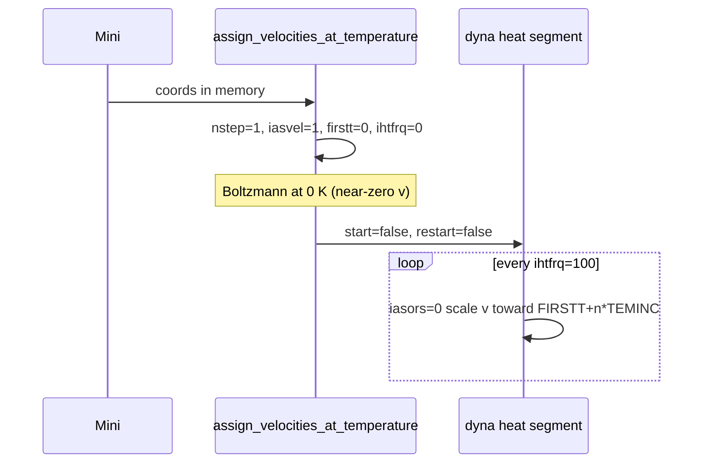

# COMP, velocity assignment, and heating (verification guide)

This document is for **debugging DCM:9 (and similar) heat instability** without changing
production defaults. Read it before enabling experimental flags.

## What your DCM:9 script does by default

`scripts/run_dcm9_stability.sh` (current defaults):

| Control | Value | Effect |
|---------|-------|--------|
| `--heat-comp-damp` | **off** (default) | **COMP recipe is not run**; nothing in `comp_velocities.py` affects `dyna` |
| `--heat-firstt` / `--heat-finalt` | 0 → 240 K | CHARMM `FIRSTT` / `FINALT` / `TBATH` |
| `--ps-heat` | 20 ps | `nstep` from timestep |
| `--heat-ihtfrq` | 100 | Velocity **scaling** every 100 steps |
| `iasors` (in code) | **0** | Scale existing velocities at `ihtfrq` (no Gaussian redraw) |
| `iasvel` (in code) | **1** | Used only for the **one-time** Boltzmann draw at 0 K before main heat |
| ML dynamics | USER only | **No SHAKE** on X–H |

**H collapsing onto C between DCD frames is not caused by COMP in the default script**, because COMP is not loaded into the dynamics path. It is consistent with **unconstrained X–H** under ML forces plus aggressive early heating.

## How to verify what actually ran (grep the log)

After a run, confirm:

```bash
grep -E 'HEAT (ramp|COMP|Boltzmann)|IASORS|IASVEL|IHTFRQ|TEMINC|FIRSTT|heat-comp' your.log
```

You want to see:

```
HEAT: Boltzmann velocities at FIRSTT=0.0 K ...
HEAT ramp: 0.0 -> 240.0 K over 20.0 ps | ihtfrq=100 TEMINC=... | iasors=0 (scale)
```

You should **not** see (unless you explicitly enabled `--heat-comp-damp`):

```
HEAT COMP: force-damp metadata on ...
```

In the CHARMM `dyna` banner (printed once per segment):

- `IASORS = 0` — scale at `ihtfrq`
- `IASVEL = 1` — assignment method when assignment is requested
- `IHTFRQ = 100`, `TEMINC` ≈ `(240 - 0) / (nstep // 100)` K per rescale (~0.3 K for 20 ps @ 0.25 fs)

You should **not** see every 100 steps:

```
GAUSSIAN OPTION ... VELOCITIES ASSIGNED AT TEMPERATURE
```

(that pattern means `iasors=1` Gaussian reassignment — old harsh path).

## CHARMM: comparison set (COMP) vs our Python recipe

### CHARMM (documentation)

- **Comparison coordinates** are a separate set (`coor set comp`, `coor show comp`).
- **`IASVEL = 0`**: use comparison-coordinate values for velocity assignment (with `STRT` / start).
- **`IASVEL = 1`**: Gaussian Maxwell–Boltzmann assignment (default).
- **`IASORS = 0`**: at each `ihtfrq` / `ieqfrq`, **scale** existing velocities toward the target temperature.
- **`IASORS ≠ 0`**: **assign** new velocities at each `ihtfrq` (uses `IASVEL`).

COMP is only consumed by dynamics when you use the **comparison-velocity** assignment path (`iasvel=0` with velocities stored in COMP), not when you only copy forces into `xcomp`/`ycomp`/`zcomp`.

### mmml `comp_velocities.py` (actual behavior)

`apply_selective_force_damp_recipe`:

1. `ENER` (MLpot USER energy).
2. Zero all `xcomp`, `ycomp`, `zcomp`, `wcomp`.
3. On atoms with \|F\| ≥ threshold (optional H-only):  
   `scalar xcomp copy dx` (and y, z), then `mult 0.01`.
4. Does **not** copy velocities into COMP.
5. Does **not** call `dyna`.

So the name “force-damp” means **scaled force components are written into COMP scalars** for a hypothetical `iasvel=0` workflow. With default **`--heat-comp-damp` off**, this never runs before heat.

**Enabling `--heat-comp-damp` does not change `iasvel` / `iasors` today**; it only prints metadata counts. It is experimental and should stay off until a real COMP-velocity path is designed and tested.

Integration tests (`tests/functionality/mlpot/test_comp_velocities_integration.py`) prove force copy into COMP arrays only — not heating stability.

## Velocity scaling path (current heat)



Implications:

- Early frames (e.g. DCD frames 5–6 at `nsavc=500` ≈ 0.6–0.75 ps) are still in the **coldest** part of the ramp.
- Scaling increases **kinetic** energy; it does **not** fix bad **internal** coordinates (H too close to C).
- Without SHAKE or X–H restraints, a few bad integration steps can produce unphysical H–C overlap; ML energy at that geometry is **wrong by construction**.

## DCD frame index vs time (DCM:9 defaults)

With `dcd-nsavc=500`, `dt-fs=0.25` (0.00025 ps/step):

| Frame | Step | Time (ps) |
|-------|------|-----------|
| 0 | 0 | 0 |
| 5 | 2500 | 0.625 |
| 6 | 3000 | 0.75 |

Instability “between frames 5 and 6” is sub-picosecond early heat — inspect mini geometry and frame 0–1 as well.

## Safe experiments (one change at a time)

Do **not** combine these in one run until each is understood.

1. **Baseline (current)** — `run_dcm9_stability.sh` as-is; confirm log lines above.
2. **Slower ramp only** — `PS_HEAT=40` (halves `TEMINC`).
3. **Finer rescale cadence** — `HEAT_IHTFRQ=50` (smaller steps in T, more frequent scaling).
4. **Diagnostic** — `--no-echeck` once to see if run completes (does not fix physics).
5. **COMP (experimental)** — `--heat-comp-damp` only after reading this doc; compare log for `HEAT COMP:` line; expect **no** improvement unless COMP-velocity is implemented properly.

Avoid re-enabling **`iasvel=0` on the main heat `dyna`** without a true COMP-velocity load — that freezes the ramp (see prior “IASVEL is zero” logs).

Avoid **`iasors=1`** with short `ihtfrq` on all-ML clusters unless you accept Gaussian spikes (219 K before rescale to 66 K in earlier logs).

## Likely mitigations for X–H (not yet default)

- Longer / cooler ramp (already biased in `run_dcm9_stability.sh`).
- Bonded or X–H distance restraints during heat only.
- Hoover / staged plateaus with restart velocities (not implemented).
- Post-mini geometry check (bond lengths) before heat.

## Code map

| File | Role |
|------|------|
| `comp_velocities.py` | COMP scalar force copy; optional pre-heat metadata |
| `staged_workflow.py` | `_configure_heat_dynamics_start`, `iasors=0`, Boltzmann pre-step |
| `dynamics.py` | `build_heat_dynamics`, `assign_velocities_at_temperature`, `apply_heat_ramp_frequencies` |
| `cli_common.py` | `--heat-firstt`, `--heat-finalt`, `--heat-comp-damp` (default off) |
