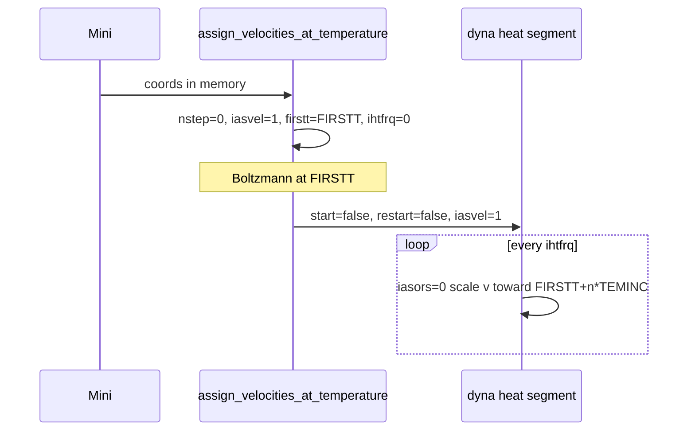
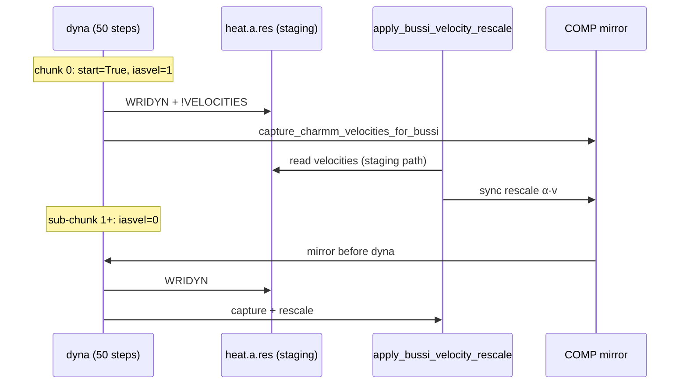

# COMP, velocity assignment, and heating (verification guide)

This document is for **debugging DCM:9 (and similar) heat instability** without changing
production defaults. Read it before enabling experimental flags.

## What your DCM:9 script does by default

`scripts/run_dcm9_stability.sh` (current defaults):

| Control | Value | Effect |
|---------|-------|--------|
| `--heat-comp-damp` | **off** (default) | **COMP recipe is not run**; nothing in `comp_velocities.py` affects `dyna` |
| `--heat-firstt` / `--heat-finalt` | 0 → 240 K | CHARMM `FIRSTT` / `FINALT` / `TBATH` |
| `--ps-heat` | 20 ps | `nstep` from timestep |
| `--heat-ihtfrq` | 100 | Velocity **scaling** every 100 steps |
| `iasors` (in code) | **0** | Scale existing velocities at `ihtfrq` (no Gaussian redraw) |
| `iasvel` (in code) | **1** | Used only for the **one-time** Boltzmann draw at 0 K before main heat |
| ML dynamics | USER only | **No SHAKE** on X–H |

**H collapsing onto C between DCD frames is not caused by COMP in the default script**, because COMP is not loaded into the dynamics path. It is consistent with **unconstrained X–H** under ML forces plus aggressive early heating.

## How to verify what actually ran (grep the log)

After a run, confirm:

```bash
grep -E 'HEAT (ramp|COMP|Boltzmann)|IASORS|IASVEL|IHTFRQ|TEMINC|FIRSTT|heat-comp' your.log
```

You want to see:

```
HEAT: Boltzmann velocities at FIRSTT=0.0 K ...
HEAT ramp: 0.0 -> 240.0 K over 20.0 ps | ihtfrq=100 TEMINC=... | iasors=0 (scale)
```

You should **not** see (unless you explicitly enabled `--heat-comp-damp`):

```
HEAT COMP: force-damp metadata on ...
```

In the CHARMM `dyna` banner (printed once per segment):

- `IASORS = 0` — scale at `ihtfrq`
- `IASVEL = 1` — assignment method when assignment is requested
- `IHTFRQ = 100`, `TEMINC` ≈ `(240 - 0) / (nstep // 100)` K per rescale (~0.3 K for 20 ps @ 0.25 fs)

You should **not** see every 100 steps:

```
GAUSSIAN OPTION ... VELOCITIES ASSIGNED AT TEMPERATURE
```

(that pattern means `iasors=1` Gaussian reassignment — old harsh path).

## CHARMM: comparison set (COMP) vs our Python recipe

### CHARMM (documentation)

- **Comparison coordinates** are a separate set (`coor set comp`, `coor show comp`).
- **`IASVEL = 0` + `START`**: CHARMM assigns **initial velocities from COMP** (AKMA units).
  Log banner: `The comparison coordinate values will be used for the initial velocities`.
  **Do not use this path in mmml**: `sync_charmm_positions` writes **coordinates** into COMP,
  so `iasvel=0` + `start=True` produces absurd kinetic energy (e.g. T≫target at step 0).
- **`IASVEL = 1` + `START`**: Gaussian Maxwell–Boltzmann assignment (default cold start).
- **`START` omitted** (`start=False` in PyCHARMM): the `start` keyword is **not** sent to
  CHARMM. START may **linger** from a prior `dyna` in the same session (e.g. the
  `nstep=0` Boltzmann assign). With lingering START + `iasvel=0`, CHARMM still reads
  comparison **coordinates** as velocities.
- **mmml mitigation**: do not copy main coords into COMP (`sync_charmm_positions`);
  zero comparison coordinates before dynamics; use `iasvel=1` on post-assign `dyna`
  so lingering START falls back to Boltzmann, not COMP.
- **`IASORS = 0`**: at each `ihtfrq` / `ieqfrq`, **scale** existing velocities toward the target temperature.
- **`IASORS ≠ 0`**: **assign** new velocities at each `ihtfrq` (uses `IASVEL`).

COMP is only consumed by dynamics when you use the **comparison-velocity** assignment path (`iasvel=0` with velocities stored in COMP), not when you only copy forces into `xcomp`/`ycomp`/`zcomp`.

### mmml `comp_velocities.py` (actual behavior)

`apply_selective_force_damp_recipe`:

1. `ENER` (MLpot USER energy).
2. Zero all `xcomp`, `ycomp`, `zcomp`, `wcomp`.
3. On atoms with \|F\| ≥ threshold (optional H-only):  
   `scalar xcomp copy dx` (and y, z), then `mult 0.01`.
4. Does **not** copy velocities into COMP.
5. Does **not** call `dyna`.

So the name “force-damp” means **scaled force components are written into COMP scalars** for a hypothetical `iasvel=0` workflow. With default **`--heat-comp-damp` off**, this never runs before heat.

**Enabling `--heat-comp-damp` does not change `iasvel` / `iasors` today**; it only prints metadata counts. It is experimental and should stay off until a real COMP-velocity path is designed and tested.

Integration tests (`tests/functionality/mlpot/test_comp_velocities_integration.py`) prove force copy into COMP arrays only — not heating stability.

## Velocity scaling path (current heat)



Hoover CPT after mini still uses **one** ``dyna`` with ``start=True`` (barostat init).
Scale heat after mini uses the assign + ``start=False`` path above so overlap chunk 0
(``preserve_ihtfrq_heat_ramp``) does not clear ``start`` without a prior assign.

Implications:

- Early frames (e.g. DCD frames 5–6 at `nsavc=500` ≈ 0.6–0.75 ps) are still in the **coldest** part of the ramp.
- Scaling increases **kinetic** energy; it does **not** fix bad **internal** coordinates (H too close to C).
- Without SHAKE or X–H restraints, a few bad integration steps can produce unphysical H–C overlap; ML energy at that geometry is **wrong by construction**.

## DCD frame index vs time (DCM:9 defaults)

With `dcd-nsavc=500`, `dt-fs=0.25` (0.00025 ps/step):

| Frame | Step | Time (ps) |
|-------|------|-----------|
| 0 | 0 | 0 |
| 5 | 2500 | 0.625 |
| 6 | 3000 | 0.75 |

Instability “between frames 5 and 6” is sub-picosecond early heat — inspect mini geometry and frame 0–1 as well.

## Safe experiments (one change at a time)

Do **not** combine these in one run until each is understood.

1. **Baseline (current)** — `run_dcm9_stability.sh` as-is; confirm log lines above.
2. **Slower ramp only** — `PS_HEAT=40` (halves `TEMINC`).
3. **Finer rescale cadence** — `HEAT_IHTFRQ=50` (smaller steps in T, more frequent scaling).
4. **Diagnostic** — `--no-echeck` once to see if run completes (does not fix physics).
5. **COMP (experimental)** — `--heat-comp-damp` only after reading this doc; compare log for `HEAT COMP:` line; expect **no** improvement unless COMP-velocity is implemented properly.

Avoid **`iasvel=0`** on post-assign / overlap-continuation `dyna` unless COMP holds real
velocity components and you explicitly want that path. After Boltzmann assign,
rescue `sync_charmm_positions`, or CRD reload, use **`start=False`** and
**`iasvel=1`** so lingering START cannot read comparison coordinates as velocities.
`sync_charmm_positions` zeros COMP; overlap Hoover/scale heat chunks set
`iasvel=1` after chunk 0.

Avoid **`iasors=1`** with short `ihtfrq` on all-ML clusters unless you accept Gaussian spikes (219 K before rescale to 66 K in earlier logs).

## ASE Bussi heat (`--heat-thermostat bussi`)

Default staged heat uses **ASE Bussi stochastic rescaling** with CHARMM `ihtfrq=0`
(no CHARMM velocity-scaling ramp). CHARMM still does Verlet integration; Python
rescales velocities between micro-chunks.

### Correct handoff pattern

| Segment | `start` | `iasvel` | Velocity source |
|---------|---------|----------|-----------------|
| Chunk 0 / cold start | `True` | `1` | One Boltzmann draw at `FIRSTT` |
| Sub-chunks 1+ / overlap continuation | `False` | `0` | COMP mirrored from main (or restart) |

**Do not** set `iasvel=1` on Bussi continuation chunks: PyCHARMM may omit `start=False`,
CHARMM keeps lingering START, and each sub-chunk re-draws Boltzmann (COM drift, box stress).

Before every `iasvel=0` `dyna`, mmml calls
`mirror_comparison_velocities_for_dynamics()` (main → warm COMP → restart `!VELOCITIES`).
After every Bussi `dyna`, `capture_charmm_velocities_for_bussi()` stores AKMA velocities
in the synced cache and COMP for the next rescale / sub-chunk.

### Restart I/O and CHARMM staging paths

Overlap heat alternates scratch restarts (`heat.a.res` / `heat.b.res`) and may stage
writes under `/tmp/mmml-charmm-io/<hash>/` when the real path has capitals (Fortran
`OPEN` limits). CHARMM writes `!VELOCITIES` to the **staging** file first; the alias is
copied back to the user path only when the I/O handle closes (`CharmmIoAlias.finalize()`).

**Failure mode (fixed):** reading `heat.res` immediately after `dyna`, before finalize,
sees a missing or stale file → `ASE Bussi rescale: no readable velocities` → MB fallback
→ `apply_bussi_velocity_rescale: CHARMM velocities unavailable`.

mmml now resolves restart reads via `resolve_restart_velocities_read_paths()`:

1. User path (e.g. `.../heat.res`)
2. Overlap slots (`heat.a.res`, `heat.b.res`)
3. Staging alias (`/tmp/mmml-charmm-io/<hash>/heat.res`)

Post-`dyna` capture uses `_post_dyna_restart_write_path()` so Bussi reads the staging
file while it still holds fresh velocities. A synced in-memory cache
(`charmm_synced_velocities_akma`) is the fallback when PyCHARMM lacks `coor.get_velocity`.

### Log grep (Bussi)

```bash
grep -E 'Bussi rescale|readable velocities|IASVEL|IASORS|heat\.a\.res|heat\.b\.res|mmml-charmm-io' your.log
```

Red flags:

```
NOTE: The comparison coordinate values will be used for the initial velocities
DYNA> ... TEMPerature 1.E+09 or higher at step 0
```

Healthy Bussi continuation (sub-chunk 2+):

```
IASVEL = 0   (init_velocities passed via C API; not COMP positions)
(no COMP-as-velocity NOTE, or NOTE with sane T at step 0)
```

Other red flags:

```
ASE Bussi rescale: no readable velocities          # OK if followed by MB / in-memory draw
apply_bussi_velocity_rescale: CHARMM velocities unavailable   # should not appear
```

After overlap rescue or CGENFF ``reregister_mlpot``, mmml rehydrates velocities
(restart ladder → in-memory Maxwell–Boltzmann) before ``iasvel=0`` sub-chunks.
``run_dynamics`` passes them via ``init_velocities`` on the C API path (never
hard-fails with empty CHARMM memory after CGENFF).

Ensure overlap micro-chunks keep `nsavv=nstep` so scratch restarts include
`!VELOCITIES` (see `_harmonize_overlap_chunk_frequencies` in `dynamics.py`).

### Bussi sequence (overlap micro-chunks)



## Likely mitigations for X–H (not yet default)

- Longer / cooler ramp (already biased in `run_dcm9_stability.sh`).
- Bonded or X–H distance restraints during heat only.
- Hoover / staged plateaus with restart velocities (not implemented).
- Post-mini geometry check (bond lengths) before heat.

## Code map

| File | Role |
|------|------|
| `comp_velocities.py` | COMP scalar force copy; COMP velocity mirror for `iasvel=0` |
| `charmm_ase_velocities.py` | ASE Maxwell–Boltzmann / Bussi; velocity cache; restart path resolution |
| `staged_workflow.py` | `_configure_heat_dynamics_start`, `iasors=0`, Boltzmann pre-step |
| `dynamics.py` | `build_heat_dynamics`, Bussi sub-chunking, overlap restart staging, `nsavv` |
| `cli_common.py` | `--heat-firstt`, `--heat-finalt`, `--heat-thermostat`, `--heat-comp-damp` (default off) |
