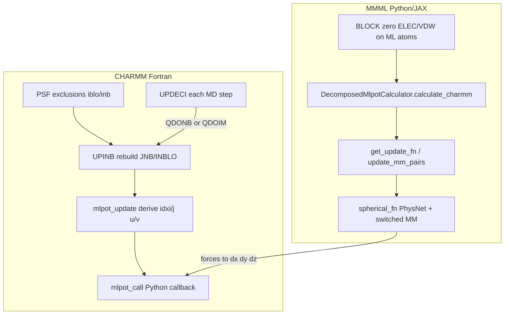
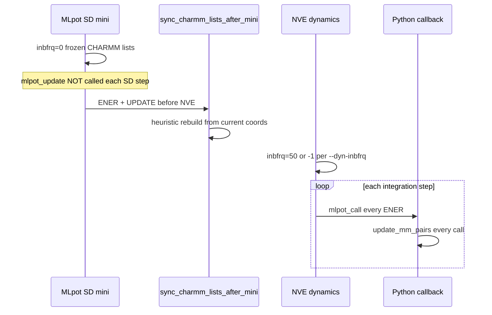

# ML-Pot nonbond lists

Technical reference for how **CHARMM** and **MMML** neighbor lists interact in the ML-Pot hybrid potential, how update frequencies govern list freshness, and which mismatches are likely contributors to NVE instabilities.

Related: [CHARMM_SETTINGS.md](CHARMM_SETTINGS.md) (CLI defaults), [README.md](README.md) (workflow order), Fortran patches under [`setup/`](../../../setup/).

---

## Overview

ML-Pot is a **hybrid potential** integrated into CHARMM as a USER energy term. CHARMM owns the integrator, coordinates, and classical MM terms on non-ML atoms. The ML contribution (PhysNet monomer/dimer batches + switched MM in JAX) is computed in Python and returned via a ctypes callback registered at setup.



### Setup path

| Step | Where | What happens |
|------|-------|--------------|
| 1 | [`block_terms.py`](block_terms.py) | BLOCK zeros CHARMM ELEC/VDW on ML atoms; optional scaled BOND/ANGL/DIHE |
| 2 | [`pycharmm/energy_mlpot.py`](../../../../pycharmm/energy_mlpot.py) | ML–ML pairs added to PSF `iblo/inb` exclusions |
| 3 | `nbonds.update_bnbnd()` → `UPINB` | Full CHARMM nonbond list build from PSF topology |
| 4 | `image.update_bimag()` | Image nonbond lists (PBC) |
| 5 | [`setup/api/api_func.F90`](../../../setup/api/api_func.F90) | `mlpot_set_func` + `mlpot_set_properties` register callback and ML atom map |

Registration is orchestrated by [`setup.py`](setup.py) (`register_mlpot`).

### Energy each integration step

```
CHARMM ENER → mlpot_call → Python calculate_charmm
           → subtract ML forces into dx, dy, dz
           → CHARMM adds bonded / residual MM terms separately
```

---

## Two independent nonbond list systems

**CHARMM and MMML maintain separate lists** with different cutoffs, update policies, and (for the decomposed PhysNet path) different pair sources. This is the central point for instability analysis.

| Layer | Owner | What it lists | Outer cutoff | When it updates |
|-------|-------|---------------|--------------|-----------------|
| CHARMM `JNB` / `INBLO` | Fortran `NBONDS` | MM atom pairs for Fortran ELEC/VDW (zero on ML via BLOCK) | Vacuum: `cutnb=18`, `ctonnb=13`, `ctofnb=17` Å ([`nbonds_config.py`](../nbonds_config.py)); PBC legacy: 14/10/12 Å | `inbfrq`, `imgfrq`, displacement heuristic |
| `mlpot_update` derived lists | [`api_func.F90`](../../../setup/api/api_func.F90) | `idxi/idxj` (ML–ML), `idxu/idxv` (ML–MM) scraped from CHARMM lists | Same as CHARMM list radius | Only when `QDONB.or.QDOIM.or.QDOXT` in [`heurist.F90`](../../../setup/nbonds/heurist.F90) |
| Python MM pairs | [`mm_energy_forces.py`](../mm_energy_forces.py) | Cross-monomer atom pairs for switched LJ + Coulomb in JAX | `mm_switch_on + mm_switch_width` = **13.0 Å** default (8 + 5) | **Every** `calculate_charmm` call via `get_update_fn` |
| Python ML dimers | [`hybrid_mlpot.py`](hybrid_mlpot.py) | Monomer permutations (vacuum: all; PBC: sparse cap) | PhysNet model cutoff + COM handoff ([`cutoffs.py`](../cutoffs.py)) | Every callback; no CHARMM list input |

---

## CHARMM layer

### PSF exclusions (ML–ML)

At `MLpot.__init__`, all ML atom pairs are inserted into the PSF exclusion list (`iblo`/`inb`) so CHARMM MM does not double-count pairs that the ML potential evaluates:

```81:93:pycharmm/energy_mlpot.py
        # ML - set non-bond exclusion list for ML atom pairs
        self.ml_iblo = np.zeros(self.Natoms, dtype=int)
        self.ml_inb = []
        for ii, idx in enumerate(ml_indices):
            self.ml_iblo[idx:] += self.ml_Natoms - ii - 1
            for jdx in self.ml_indices[(ii + 1):]:
                self.ml_inb.append(jdx + 1)  # + 1 as CHARMM start at index 1
        self.ml_nnb = len(self.ml_inb)

        pycharmm.psf.set_iblo_inb(self.ml_iblo, self.ml_inb)

        pycharmm.nbonds.update_bnbnd()  # Already executed in set_iblo_inb()
        pycharmm.image.update_bimag()
```

`update_bnbnd()` calls Fortran `UPINB`, which rebuilds `JNB`/`INBLO` from PSF topology and current geometry.

### `mlpot_update`: deriving ML pair indices from CHARMM lists

After `NBONDS` rebuilds `JNB`/`INBLO` (and image lists when PBC is active), `mlpot_update` in [`api_func.F90`](../../../setup/api/api_func.F90) derives index arrays passed into the Python callback:

- **ML–ML (`idxi`, `idxj`)**: precomputed upper-triangle over ML atom indices. With PBC, adds image-cell replicas via `IMATTR`/`IMJNB`.
- **ML–MM (`idxu`, `idxv`)**: for each ML atom `u`, walks CHARMM nonbond entries involving `u` and collects MM partners still present in `JNB` after ML–ML exclusions.

Trigger during dynamics ([`heurist.F90`](../../../setup/nbonds/heurist.F90)):

```fortran
if(mlpot_is_set().and.(QDONB.or.QDOIM.or.QDOXT)) then
  call mlpot_update(natom, ntrans, natim, jnb, inblo, imattr, imjnb, imblo)
endif
```

`mlpot_call` invokes `mlpot_update` on the **first** energy evaluation only if `mlpot_is_init` is false; subsequent updates depend on `UPDECI` triggers, not every `ENER` call.

### `inbfrq` and the displacement heuristic

Controlled via `nbonds.set_inbfrq()` ([`api_nbonds.F90`](../../../setup/api/api_nbonds.F90)):

| Value | Behavior |
|-------|----------|
| `0` | Never rebuild nonbond lists during this stage |
| `+n` | Rebuild every `n` integration steps (`MOD(ISTEP, INBFRQ) == 0`) |
| `-1` | Rebuild when **any atom** moves more than `(CUTNB - CTOFNB) / 2` since last update |

The displacement test is the CHARMM "skin buffer" ([`heurist.F90`](../../../setup/nbonds/heurist.F90) `heuristic_check`):

```59:61:setup/nbonds/heurist.F90
  ! Heuristic update-testing :
  ! If any atom moves by more than half CUTNB-CTOFNB, then an
  ! nonbond-list update is performed.
```

With vacuum defaults (`cutnb=18`, `ctofnb=17`), the skin is **0.5 Å**. `QDONB` is set in `UPDECI`:

```423:425:setup/nbonds/heurist.F90
  QDONB=.FALSE.
  IF(INBFRQ > 0) QDONB = (MOD(ISTEP,INBFRQ) == 0) .OR. QDOIM
  IF(INBFRQ < 0) QDONB = QEURIS
```

### PBC image lists

When MLpot is active, `UPIMNB` calls `MKIMNB_MLPOT` to build image nonbond exclusions that account for ML atom pairs ([`upimag_util.F90`](../../../setup/image/upimag_util.F90)).

### Unsafe operations with MLpot registered

Re-calling `update_bnbnd()` / `upinb` after MLpot registration can **segfault** on large all-ML systems. The workflow therefore:

- Uses `inbfrq=0` during MLpot SD (avoids `mlpot_update` each step).
- Syncs lists after mini with `CHARMM UPDATE` only — not full `upinb` ([`sync_charmm_lists_after_mini`](dynamics.py)).
- Bonded recovery uses `prepare_rescue_lists_safe` (UPDATE only, optional `NBXMOD 2` script) — not `apply_recovery_nbonds` / `upinb` ([`topology_recovery.py`](topology_recovery.py)).
- Re-attaches MLpot via `reattach_mlpot()` without rebuilding `iblo/inb` ([`setup.py`](setup.py), [`energy_mlpot.py`](../../../../pycharmm/energy_mlpot.py)).

---

## MMML layer

### Vacuum: static cross-monomer pairs

When `pbc_cell` is `None`, [`build_mm_energy_forces_fn`](../mm_energy_forces.py) builds **all** cross-monomer atom pairs statically (no spatial cull):

```362:384:mmml/interfaces/pycharmmInterface/mm_energy_forces.py
    else:
        pair_idx_list = []
        pair_lambda_list = []
        n_pairs_per_dimer_list = []
        for mi, mj in _dp:
            off_i = int(monomer_offsets[mi])
            off_j = int(monomer_offsets[mj])
            n_i = atoms_per_monomer_list[mi]
            n_j = atoms_per_monomer_list[mj]
            local_pairs = np.array(
                [(a + off_i, b + off_j) for a in range(n_i) for b in range(n_j)],
                dtype=np.int32,
            )
            ...
```

Pair **contributions** taper via `s_MM(r)` and complementary ML/MM handoff ([`cutoffs.py`](../cutoffs.py)); atoms and monomers are never removed from the system. See [CHARMM_SETTINGS.md § ML/MM pair list vs `mm_r_min`](CHARMM_SETTINGS.md).

### PBC: jax-md neighbor lists

When `pbc_cell` is set and jax-md is available, neighbor lists culling is performed:

- **Outer list radius**: `mm_switch_on + mm_switch_width` (default 13 Å).
- **Internal rebuild trigger**: `dr_threshold=0.5` Å ([`jax_md_neighbor_list.py`](../jax_md_neighbor_list.py)).
- **Optional caching** in `update_mm_pairs`:
  - `jax_md_update_interval` (default 1): skip rebuild check every N calls.
  - `jax_md_skin_distance` (default 0): reuse list until max atom displacement ≤ skin.

The cadence and method of updating these lists depend on the **simulation runner/backend**:

#### 1. ASE Calculator (`AseDimerCalculator`)
- **Cadence**: Re-evaluated on **every single step** of MD or minimization within the calculator's `calculate()` method.
- **Mechanism**: The calculator calls the Python-level `update_mm_pairs` function directly on each callback, which leverages the caching logic (interval/skin) to skip rebuilds if allowed. Since it is run inside a step-by-step Python integrator loop, there is no JIT compilation stale-list issue.

#### 2. Pure JAX-MD Simulations (`jaxmd_runner.py`)
- **JIT Compilation Constraint**: The cell-list building logic in `update_fn` is Python/NumPy-based (to handle exclusion mapping and memory allocation) and cannot be run inside a GPU/CPU JIT-compiled `fori_loop` or `scan`. Thus, neighbor list updates must occur at the outer Python loop level at block boundaries (`steps_per_recording`).
- **NPT Ensemble**:
  - **Cadence**: Refreshed once per recording block (typically every 25 steps) using fractional coordinates.
  - **Mechanism**: The box changes at every step. At block boundaries, the outer Python loop queries the current box matrix, converts coordinates to fractional, calls `update_fn(pos, box=box)`, and passes the resulting neighbor list tuple (`neighbor`) to the compiled JAX step.
- **NVT & NVE Ensembles**:
  - **Cadence**: Refreshed once per recording block (defaults to 100/1000 steps depending on arguments) using real coordinates.
  - **Mechanism**: The outer loop calls `update_fn(pos, box=pbc_box_nl)` to calculate the updated neighbor lists at block boundaries.
  - **Compilation Staleness Fix**: JAX's JIT compiler captures closure dictionary variables like `_pbc_state` as static constants at JIT time. If the dynamic neighbor lists are not explicitly passed as arguments to the JITted step, the compiled graph freezes the first neighbor list forever. We resolved this by modifying the JAX-MD integrators (`sim`), the force function (`wrapped_force_fn`), and the energy function (`wrapped_energy_fn`) to accept `neighbor` as an explicit, dynamic keyword argument.

### Decomposed callback ignores Fortran pair indices

[`DecomposedMlpotCalculator.calculate_charmm`](hybrid_mlpot.py) accepts `idxu`, `idxv`, `idxi`, `idxj` from Fortran but **does not use them**. ML and MM pairs are determined entirely in Python:

```141:143:mmml/interfaces/pycharmmInterface/mlpot/hybrid_mlpot.py
            if self.do_mm and self._get_update_fn is not None:
                self._get_update_fn(pos, self.cutoff_params, box=box)
```

CHARMM-derived lists are informational today; they are intended for future ML–MM embedding electrostatics.

---

## Synchronization contract (workflow stages)



| Stage | CHARMM `inbfrq` | `mlpot_update` | Python `update_mm_pairs` | Risk if misconfigured |
|-------|-----------------|----------------|--------------------------|------------------------|
| MLpot SD | **0** ([`_sd_kwargs_from_config`](dynamics.py)) | Once on first ENER via `mlpot_call`, then frozen | Every ENER | Lists stale for remainder of mini as geometry changes |
| Post-mini sync | `ENER` + `UPDATE` ([`sync_charmm_lists_after_mini`](dynamics.py)) | Runs once | N/A | **Required** before NVE; skip with `--no-pre-nve-charmm-update` at risk |
| Vacuum NVE default | **50** | Every 50 steps | Every step | CHARMM lists stale between rebuilds |
| Vacuum NVE heuristic | **-1** | On displacement | Every step | Better for moving clusters |
| PBC dynamics | **-1**, `imgfrq=-1` | On NB/image rebuild | jax-md with skin | Image + jax-md tuning |

MLpot SD also forces `imgfrq=0` when `inbfrq=0` (CHARMM constraint: "INBFRQ is zero when IMGFRQ is not") — see [`_prepare_mlpot_sd_list_frequencies`](dynamics.py).

### Recommended defaults

| Scenario | `inbfrq` | `pre_nve_charmm_update` | Notes |
|----------|----------|-------------------------|-------|
| MLpot SD | `0` | N/A | Never call `upinb` mid-mini |
| Vacuum NVE (small/moving cluster) | **`-1`** | on | Displacement heuristic |
| Vacuum NVE (screening) | sweep `[-1, 1, 10, 50]` | on | [`workflows/dcm_nve_scaling/`](../../../workflows/dcm_nve_scaling/) |
| PBC production | `-1`, `imgfrq=-1` | on | jax-md: `interval=1`, `skin=0` |

CLI: `--dyn-inbfrq N`, `--pre-nve-charmm-update` / `--no-pre-nve-charmm-update` ([`md_system.py`](../../cli/run/md_system.py)).

---

## Instability checklist

Ranked by relevance to NVE instabilities observed in [`dcm_nve_scaling`](../../../workflows/dcm_nve_scaling/) (`nve_inbfrq_values: [-1, 1, 10, 50]` with COM displacement QC).

| # | Issue | Symptom | Likely cause | Mitigation |
|---|-------|---------|--------------|------------|
| 1 | Stale CHARMM lists after mini | Force jump at first NVE step; COM outlier at frame 0 | `inbfrq=0` during SD; lists not synced | Keep `pre_nve_charmm_update` on (default) |
| 2 | Fixed `inbfrq=50` vs heuristic `-1` | Drift/outliers worse at `inbfrq=50` than `-1` | Lists rebuilt every 12.5 fs (at 0.25 fs) regardless of motion; Python updates every step | `--dyn-inbfrq -1` for vacuum NVE |
| 3 | Dual-list cutoff mismatch | Subtle force inconsistency at long range | CHARMM ~18 Å vs Python MM 7 Å vs PhysNet cutoff | Low impact when ML ELEC/VDW are BLOCK-zeroed; watch partial-MM paths |
| 4 | Unused Fortran pair indices | N/A today (Python ignores `idxu/idxv`) | CHARMM and Python disagree at Fortran layer | Future embedding work must reconcile |
| 5 | `mlpot_is_init` caching | Stale `idxi/j/u/v` if `mlpot_update` skipped | Updates only on `QDONB`; not every ENER | Low impact today; relevant for future embedding |
| 6 | jax-md skin / interval (PBC) | Force discontinuities near cutoff | Aggressive `jax_md_skin_distance` or `update_interval > 1` | Defaults: interval=1, skin=0 |
| 7 | Sparse dimer cap (PBC) | Missing ML dimer contributions | Cap too low ([`mlpot_sparse_dimer_policy.py`](mlpot_sparse_dimer_policy.py)) | Free-space: all dimers; PBC: `max(1000, 6n)` default |
| 8 | `mm_r_min` mis-tuning | Handoff gap or double-counting | MM scaled to zero inside handoff zone | Keep `mm_r_min` below `mm_switch_on - ml_switch_width` |
| 9 | Overlap rescue NBXMOD | Exclusion topology drift | Production stays on recovery `NBXMOD 2`; `NBXMOD 5` not restored | Documented in [`block_terms.py`](block_terms.py) |

Fixed `inbfrq=50` at `dt=0.25` fs means CHARMM lists refresh every **12.5 fs**. Fast-moving clusters can exceed the 0.5 Å skin buffer between rebuilds while Python MM pairs update every step — an asymmetric force consistency pattern that the `dcm_nve_scaling` sweep is designed to quantify.

---

## Diagnostics

| Tool | Path | What it checks |
|------|------|----------------|
| Pair-list geometry audit | [`scripts/validate_mlpot_pair_lists.py`](../../../scripts/validate_mlpot_pair_lists.py) | Per-dimer COM distance, ML taper zone, MM inclusion, min inter-monomer distance (no CHARMM) |
| `inbfrq` sweep + COM QC | [`workflows/dcm_nve_scaling/`](../../../workflows/dcm_nve_scaling/) | Systematic NVE stability vs `inbfrq`; `scaling_summary.csv` |
| Staged validation ladder | [`tests/functionality/mlpot/README.md`](../../../tests/functionality/mlpot/README.md) | Register → energy compare → mini → dynamics |
| COM drift analysis | [`scripts/analyze_monomer_com_dcd.py`](../../../scripts/analyze_monomer_com_dcd.py) | Cluster COM displacement, outlier ratio from DCD |

Example post-mini audit:

```bash
python scripts/validate_mlpot_pair_lists.py \
  --crd path/to/02_mlpot_mmml.crd \
  --n-monomers 8 --atoms-per-monomer 5 --free-space
```

Example `inbfrq` comparison from a DCD frame:

```bash
python scripts/validate_mlpot_pair_lists.py \
  --dcd workflows/dcm_nve_scaling/results/dcm_8_nve/inbfrq_neg1/nve_dcm_8.dcd \
  --frame 266 --n-monomers 8 --atoms-per-monomer 5 --free-space
```

---

## Fortran source map (`setup/`)

Patches are applied when building CHARMM via [`setup/install.sh`](../../../setup/install.sh). Key files:

| File | Key symbols | Role |
|------|-------------|------|
| [`setup/api/api_func.F90`](../../../setup/api/api_func.F90) | `mlpot_set_func`, `mlpot_set_properties`, `mlpot_update`, `mlpot_call`, `mlpot_is_set` | MLpot callback registration and pair-index derivation |
| [`setup/api/api_nbonds.F90`](../../../setup/api/api_nbonds.F90) | `nbonds_set_inbfrq`, `nbonds_update_bnbnd` | Python-facing `inbfrq` control and `UPINB` |
| [`setup/nbonds/nbexcl.F90`](../../../setup/nbonds/nbexcl.F90) | `UPINB` | Front-end for `MKINB`; rebuilds `JNB`/`INBLO` |
| [`setup/nbonds/heurist.F90`](../../../setup/nbonds/heurist.F90) | `heuristic_check`, `UPDECI` | Displacement heuristic; triggers `NBONDS` + `mlpot_update` |
| [`setup/image/upimag_util.F90`](../../../setup/image/upimag_util.F90) | `UPIMNB`, `MKIMNB_MLPOT` | PBC image nonbond lists with ML exclusions |

Python bindings: [`pycharmm/energy_mlpot.py`](../../../../pycharmm/energy_mlpot.py), [`pycharmm/nbonds.py`](../../../../pycharmm/nbonds.py).

---

## Python source map

| File | Role |
|------|------|
| [`mlpot/setup.py`](setup.py) | `register_mlpot`, `sync_charmm_positions`, unsafe-`upinb` guards |
| [`mlpot/hybrid_mlpot.py`](hybrid_mlpot.py) | `DecomposedMlpotCalculator.calculate_charmm` callback |
| [`mlpot/dynamics.py`](dynamics.py) | `inbfrq=0` SD kwargs, `sync_charmm_lists_after_mini`, `--dyn-inbfrq` |
| [`mm_energy_forces.py`](../mm_energy_forces.py) | `build_mm_energy_forces_fn`, `update_mm_pairs` |
| [`jax_md_neighbor_list.py`](../jax_md_neighbor_list.py) | PBC jax-md neighbor list builder |
| [`mmml_calculator.py`](../mmml_calculator.py) | `setup_calculator` factory; jax-md tuning kwargs |
| [`cutoffs.py`](../cutoffs.py) | ML/MM complementary handoff parameters |
| [`nbonds_config.py`](../nbonds_config.py) | Vacuum and PBC CHARMM cutoff presets |

---

## Open questions / future work

1. **Wire `idxu`/`idxv`** into the decomposed callback for ML–MM embedding electrostatics (stub exists in single-monomer `PyCharmm_Calculator`; not implemented for multi-monomer path).
2. **Safe recovery after MLpot** — bonded-MM-mini, overlap rescue, and extent recovery use **inplace** BLOCK toggle + `CHARMM UPDATE` only ([`topology_recovery.py`](topology_recovery.py), [`bonded_mm_recovery.py`](bonded_mm_recovery.py)). Deprecated `DELETE ATOM` + `read.psf_card` requires `MMML_ALLOW_PSF_DELETE_RELOAD=1`. `set_iblo_inb_no_update` restores pre-MLpot exclusions without `upinb` when UPDATE-only prep is insufficient.
3. **Align CHARMM and Python update cadence** — Python MM lists refresh every ENER; CHARMM lists may lag by up to `inbfrq` steps. Consider whether CHARMM list staleness affects any active code path beyond the unused Fortran indices.
4. **Vacuum spatial culling** — static all-pairs scales as O(n_monomers² × n_atoms²); acceptable for DCM clusters but may need jax-md or cell lists for very large free-space systems.
