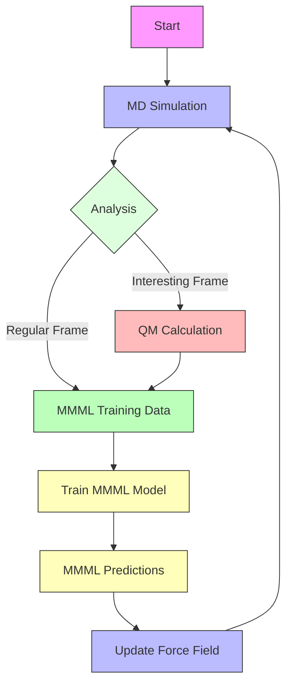

# MD-QM-MMML workflow

## MD
### Engines
#### OpenMM
#### CHARMM

## QM
### Engines
#### PySCF
#### Psi4

## MMML
### Engines
#### JaxMD
#### CHARMM

## GraphBased
### RDKit
### OpenBabel
### NetworkX

## Workflow

### 1. Starting molecule
- Read in starting molecule
- Generate conformers
- Optimize geometry
- Run Initial QM calculations 
  - Optimize geometry
  - Frequencies
  - Run single point QM calculation
  - Thermodynamics
  - Electrostatics

  - 
- Run MD simulation
  - In water
  - In vacuum
  - In hexane
- Run MMML training
- Run MMML predictions



## Examples

### Setup the residue in CHARMM
This will generate any CGenFF residue defined in the `top_all36_cgenff.rtf` file.

```bash 
python ~/mmml/mmml/pycharmm_interface/setupRes.py -r aceh
```

### Optimise the geometry of the starting molecule
Run a minimisation and a single point QM calculation, and calculate the frequencies, hessian, thermodynamic properties, and gradients.


```bash 
python ~/mmml/mmml/pyscf4gpuInterface/calcs.py --output qm/aceh.pkl --mol xyz/aceh.xyz --optimize --xc PBE0 --basis cc-pVTZ --hessian --thermo --gradient --harmonic
```

### Setup the system in CHARMM

Sets up a cubic box of pure solvent, with 1000.0 kg/m^3 density, and a side length of 35 Angstroms.

```bash     
python ~/mmml/mmml/pycharmm_interface/setupBox.py -d 1000.0 -l 35 -r aceh
```

### MD simulations with OpenMM

Runs a series of MD simulations with different temperatures and pressures.

```bash     
python openmm-test1.py --psf_file psf/system.psf --pdb_file pdb/init-packmol.pdb --working_dir $CWD --temperatures 100 200 300 --pressures 1.0 2.0 3.0 --simulation_schedule minimization equilibration NPT --integrator Langevin
```

### Extract Clusters from MD Simulations
Maximising the distance between clusters in feature space

```bash     
python ~/mmml/mmml/sample/features.py --sims_path $PWD --start 0 --end 100 --samples_per_frame 1 --n_find 2 --psf psf/system.psf --dcd dcd/npt_20250417_150052.dcd --stride 1 --logfile res/npt_20250417_150052.log --pdb pdb/initial.pdb 
```

### Standard Energy and Gradient Calculations

```bash       
python ~/mmml/mmml/pyscf4gpuInterface/calcs.py --output qm/aceh.pkl --mol xyz/aceh.xyz --optimize --xc PBE0 --basis cc-pVTZ --gradient 
```


### Extract the data

```bash     
python ...
```
### Train the ML Model

```bash     
python ...
```

### Fit the MM/ML model

```bash     
python ...
```


## Analysis

```bash     
python ...
```


