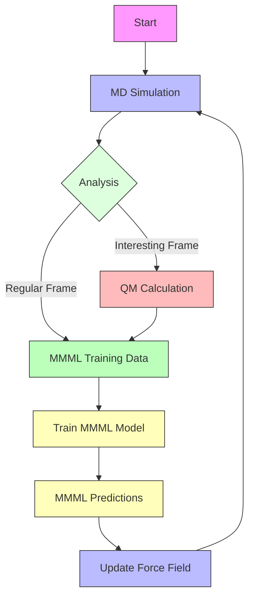

# MD-QM-MMML workflow

## MD
### Engines
#### OpenMM
#### CHARMM

## QM
### Engines
#### PySCF
#### Psi4

## MMML
### Engines
#### JaxMD
#### CHARMM

## Workflow

```mermaid
graph TD
A[Start] --> B[MD Simulation]
B --> C{Analysis}
C -->|Interesting Frame| D[QM Calculation]
C -->|Regular Frame| E[MMML Training Data]
D --> E
E --> F[Train MMML Model]
F --> G[MMML Predictions]
G --> H[Update Force Field]
H --> B
style A fill:#f9f,stroke:#333
style B fill:#bbf,stroke:#333
style C fill:#dfd,stroke:#333
style D fill:#fbb,stroke:#333
style E fill:#bfb,stroke:#333
style F fill:#ffb,stroke:#333
style G fill:#ffb,stroke:#333
style H fill:#bbf,stroke:#333
```

## Analysis
